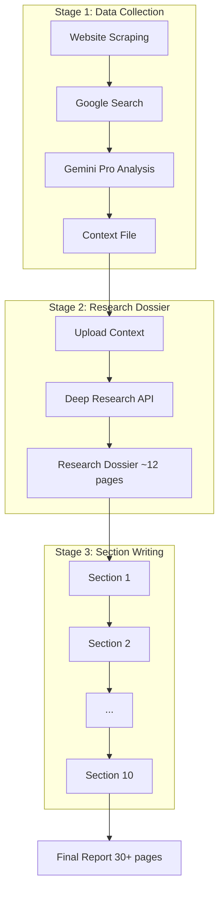

# Design Document: Accordion Method Default Pipeline

## Overview

This design fixes `--mode full` to deliver **30+ page reports** instead of the ~12 pages that a single Deep Research call produces. Nothing else changes - same CLI, same output formats, same section structure.

### The Problem

Google's Deep Research API (December 2025) has a practical output ceiling of ~8-12 pages per call, regardless of prompt instructions. When you ask for a "30-page report," it produces ~12 pages of well-researched content.

### The Fix: Accordion Method

```
Single Deep Research Call → ~12 pages (API limitation)
Accordion Method → 30+ pages (workaround)

Phase 1: Deep Research gathers facts (as "Lead Researcher") → ~12 page dossier
Phase 2: Gemini Pro writes each section (as "Writer") → expands to 30+ pages
```

This treats Deep Research as the **researcher** and Gemini Pro as the **writer**. The result is comprehensive reports with substantive content in each section.

### Validation Results

Testing with "Oceanography 2026-2030" topic confirmed:
- **Architecture**: 1 Deep Research + 11 Gemini Pro follow-ups
- **Result**: ~35 pages of detailed, relevant content in ~20 minutes
- **Quality**: Each section contains specific facts, expert insights, analytical depth

Alternative tested (12 Deep Research calls): 10x cost/time for only +20% more content - terrible ROI.

### Key Constraint

**Sequential execution required.** Gemini Pro section calls must be sequential with short delays to maintain context continuity and avoid rate limits.

## Architecture



## Components

### AccordionTestRunner

Standalone test runner for validating the method without website scraping.

```python
@dataclass
class AccordionTestConfig:
    topic: str
    target_pages: int = 35
    section_delay_seconds: int = 10

@dataclass  
class AccordionTestResult:
    content: str
    word_count: int
    page_estimate: float
    sections_completed: int
    success: bool
```

### Stage Executors

- **Stage1Executor**: Website scraping + Google Search + Gemini Pro analysis
- **Stage2Executor**: Deep Research as "Lead Researcher" → research dossier
- **Stage3Executor**: Gemini Pro writes each section sequentially

## Correctness Properties

*Properties that should hold true across all valid executions.*

### Property 1: All Sections Present
*For any* successful pipeline execution, the output should contain all configured sections.
**Validates: Requirements 1.3**

### Property 2: Research Dossier as Source
*For any* section writing prompt, the prompt should contain content from the research dossier.
**Validates: Requirements 4.2**

### Property 3: Context Continuity
*For any* section writing prompt (except first), the prompt should reference previously written sections.
**Validates: Requirements 4.3**

### Property 4: Sequential Execution
*For any* pipeline execution, section API calls should be sequential (not parallel).
**Validates: Requirements 4.4**

### Property 5: Graceful Failure Handling
*For any* pipeline with consecutive failures exceeding threshold, the pipeline should stop and return partial results.
**Validates: Requirements 9.2**

## Error Handling

- **Stage 1 failure**: Return empty context, allow pipeline to continue with limited data
- **Stage 2 failure**: Suggest `--mode scrape` as fallback
- **Stage 3 section failure**: Retry twice, then skip section and continue

## Testing Strategy

- **Unit tests**: Prompt construction, config loading
- **Property tests**: Hypothesis-based tests for correctness properties
- **Integration test**: Standalone accordion test with research topic
