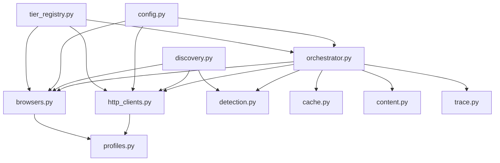

# Design Document: Resilient Scraping

## Overview

This design refactors Primr's monolithic `scrape.py` (2100+ lines) into a modular, testable architecture. The goal is to **maximize coverage** and **minimize silent failure** while providing **full traceability** for debugging.

The architecture prioritizes:

1. **Modularity** - Each concern in its own module
2. **Resilience** - Circuit breaker pattern with tiered fallbacks
3. **Stealth** - Driverless browsers and TLS fingerprint impersonation
4. **Testability** - Mocked tests, no live site dependencies
5. **Observability** - Standardized results and scrape traces for debugging

### Alignment with Primr's Purpose

Primr is for understanding companies. When scraping hard-blocks a site:
- Store discovered links + failure reason
- Rely on Deep Mode (web research) for coverage
- Do NOT escalate infinitely - that's an arms race we don't need to win

## Architecture

```
src/primr/data/scraping/
├── __init__.py           # Public API exports
├── config.py             # Constants, rate limits, dataclasses (NO tier registration)
├── models.py             # ScrapeResult, Attempt, ErrorType, BlockType
├── profiles.py           # HTTP headers, browser context, JS patches (separated)
├── cache.py              # LRU + disk caching with URL normalization
├── trace.py              # Scrape trace artifact logging
├── detection.py          # WAF/soft block/challenge detection
├── validation.py         # Content validity (density, duplicate templates)
├── content.py            # Text extraction, PDF handling (separate from fetch)
├── net.py                # Shared HTTP helpers (make_request, head_exists)
├── http_clients.py       # requests, httpx, curl_cffi tiers
├── browsers.py           # Playwright, DrissionPage, BrowserSession
├── rate_limiter.py       # Token bucket + semaphore per host
├── discovery.py          # Link discovery, sitemap, URL guessing
├── tier_registry.py      # DEFAULT_TIERS list (imports tiers, avoids circular imports)
└── orchestrator.py       # Tiered scraping coordination
```

The old `scrape.py` becomes a thin compatibility layer that imports from the new modules.



## Key Design Decisions

### D1: Separate Fetch from Extract

Tiers return **raw content** (HTML/PDF bytes). Extraction happens separately in `content.py`. This enables:
- Re-running parsing without re-scraping
- Caching raw and extracted separately
- Future improvements (readability, boilerplate removal) without tier changes
- Aligns with Primr's "raw archival" philosophy

### D2: Standardized ScrapeResult Everywhere

All tiers return `ScrapeResult` (not tuples). The orchestrator combines results. This enables:
- Consistent logging
- Consistent soft block detection
- Performance measurement
- Rich metadata for debugging

### D3: Vision Fallback is Opt-In and Returns Special Content Type

`scrape_with_vision()` is expensive and can produce garbage. It:
- Requires explicit `--vision-fallback` flag or is limited to "important pages" (leadership, products)
- Returns `content_type="vision_text"` with `raw_content=None` and `extracted_text=<vision output>`
- This avoids pretending vision output is HTML and keeps downstream logic clean

### D4: Per-Host Circuit Breaker State

If a domain repeatedly soft-blocks at tier X, skip lower tiers for future pages on that domain. Saves time in large scrapes.

### D5: Content Validity is Separate from Soft Block Detection

- **Soft block** = anti-bot / invalid response → triggers tier escalation
- **Content validity** = technically successful but low-value (nav-only, boilerplate) → does NOT escalate tiers
- Validity checks happen after extraction in `validation.py`
- Downstream consumers (report writer) can de-prioritize low-validity pages rather than treating them as equal evidence

### D6: Hard Blocks Don't Trigger Infinite Escalation

When a site hard-blocks (geo-block, 403 on all tiers):
- Store discovered links + failure reason in trace
- Mark site as "scrape-blocked" for this run
- Rely on Deep Mode for coverage
- Do NOT keep retrying with more aggressive tiers

### D7: Host Trust State and Cookie Handoff

Track per-host "trust state" to optimize tier selection:
- Once browser obtains clearance cookies (Cloudflare cf_clearance, etc.), prefer curl_cffi for subsequent URLs
- This implements the "browser phase → high-speed phase" handoff pattern
- Fresh clearance (< 10 min) allows skipping browser tiers for same host

### D8: Trace Artifact is Stable and Queryable

Trace format is versioned and designed for debugging + analytics:
- Schema version in header
- Correlation ID / run ID for grouping
- Host + tier timing metrics
- Block type + reason as enums (not free text)

## Components and Interfaces

### Models Module (`models.py`)

Centralized data models used across all modules.

```python
from dataclasses import dataclass, field
from typing import Callable, Optional
from enum import Enum
from datetime import datetime

class ErrorType(Enum):
    TIMEOUT = "timeout"
    SOFT_BLOCK = "soft_block"
    HARD_BLOCK = "hard_block"
    PARSE_ERROR = "parse_error"
    NETWORK_ERROR = "network_error"
    CHALLENGE = "challenge"

class BlockType(Enum):
    CHALLENGE = "challenge"      # Cloudflare "Just a moment", solvable
    HARD_BLOCK = "hard_block"    # 403/Access Denied, not solvable
    SOFT_BLOCK = "soft_block"    # 200 OK but fake content
    CONSENT_WALL = "consent_wall"  # Cookie consent blocking content

@dataclass
class Attempt:
    """Single tier attempt record (typed, not dict)."""
    tier: str
    success: bool
    error: Optional[str] = None
    error_type: Optional[ErrorType] = None
    elapsed_ms: Optional[float] = None
    http_status: Optional[int] = None
    blocked_reason: Optional[str] = None

@dataclass
class ValidationResult:
    """Result of content validation (separate from soft block detection)."""
    valid: bool
    reason: Optional[str] = None
    content_density: Optional[float] = None
    is_duplicate_template: bool = False

@dataclass
class HostState:
    """Per-host trust state for optimizing tier selection."""
    host: str
    cookies: Optional[dict] = None           # Clearance cookies (cf_clearance, etc.)
    last_clearance_ts: Optional[datetime] = None
    best_tier: Optional[str] = None          # Tier that worked best for this host
    hard_blocked: bool = False
    
    # Per-tier failure tracking for circuit breaker
    tier_failures: dict[str, int] = field(default_factory=dict)  # tier_name -> failure count
    
    def has_fresh_clearance(self, max_age_minutes: int = 10) -> bool:
        """Check if clearance cookies are still fresh."""
        if not self.cookies or not self.last_clearance_ts:
            return False
        age = (datetime.now() - self.last_clearance_ts).total_seconds() / 60
        return age < max_age_minutes
    
    def record_tier_failure(self, tier_name: str) -> None:
        """Record a failure for a specific tier."""
        self.tier_failures[tier_name] = self.tier_failures.get(tier_name, 0) + 1
    
    def should_skip_tier(self, tier_name: str, threshold: int = 3) -> bool:
        """Check if tier should be skipped based on failure history."""
        return self.tier_failures.get(tier_name, 0) >= threshold

@dataclass
class ScrapeResult:
    """Standardized result from every tier and orchestrator."""
    url: str
    success: bool
    raw_content: Optional[bytes] = None      # Raw HTML/PDF bytes (None for vision)
    extracted_text: Optional[str] = None     # Clean text (filled by content.py or vision)
    tier: Optional[str] = None               # Which tier succeeded
    cached: bool = False
    
    # Metadata for debugging and detection
    http_status: Optional[int] = None
    content_type: Optional[str] = None       # "html", "pdf", "vision_text"
    final_url: Optional[str] = None          # After redirects
    elapsed_ms: Optional[float] = None
    
    # Session info for cookie handoff (browser tiers populate this)
    cookies: Optional[dict] = None           # Clearance cookies for handoff to curl_cffi
    
    # Error info
    error: Optional[str] = None
    error_type: Optional[ErrorType] = None
    blocked_reason: Optional[str] = None
    
    # Content validation (filled after extraction, separate from soft block)
    validation: Optional[ValidationResult] = None
    
    # Tier attempt history (typed records)
    attempts: list[Attempt] = field(default_factory=list)

@dataclass
class ScrapeTier:
    """Configuration for a single scraping tier."""
    name: str
    scrape_fn: Callable[[str, int], ScrapeResult]
    timeout: int
    requires: Optional[str] = None  # Optional dependency check
```

### Orchestrator Module (`orchestrator.py`)

The central coordinator that implements the circuit breaker pattern with per-host state.

```python
from urllib.parse import urlparse
from datetime import datetime

class ScrapeOrchestrator:
    """Coordinates tiered scraping with circuit breaker pattern and host trust state."""
    
    def __init__(
        self, 
        tiers: list[ScrapeTier], 
        cache: ScrapeCache, 
        trace_logger: TraceLogger,
        rate_limiter: RateLimiter
    ):
        self.tiers = tiers
        self.cache = cache
        self.trace = trace_logger
        self.rate_limiter = rate_limiter
        self._host_state: dict[str, HostState] = {}  # host -> HostState
    
    def _get_host_state(self, host: str) -> HostState:
        """Get or create host state."""
        if host not in self._host_state:
            self._host_state[host] = HostState(host=host)
        return self._host_state[host]
    
    def _get_optimized_tiers(self, host: str) -> list[ScrapeTier]:
        """
        Get tier list optimized for this host based on trust state.
        
        If host has fresh clearance cookies, prefer curl_cffi over browser tiers.
        This implements the "browser phase → high-speed phase" handoff.
        """
        state = self._get_host_state(host)
        
        if state.has_fresh_clearance():
            # Reorder: put curl_cffi before browser tiers
            curl_tiers = [t for t in self.tiers if "curl" in t.name]
            other_tiers = [t for t in self.tiers if "curl" not in t.name]
            return curl_tiers + other_tiers
        
        return self.tiers
    
    def scrape(self, url: str, use_vision: bool = False, extract: bool = True) -> ScrapeResult:
        """
        Attempt to scrape URL using tiered fallback.
        
        Args:
            url: Target URL
            use_vision: Allow vision fallback (expensive, opt-in)
            extract: Whether to extract text from raw content
        
        Returns: ScrapeResult with raw_content and optionally extracted_text
        """
        host = urlparse(url).netloc
        state = self._get_host_state(host)
        result = ScrapeResult(url=url, success=False)
        
        # Check if host is hard-blocked (don't waste time)
        if state.hard_blocked:
            result.error = "Host previously hard-blocked"
            result.error_type = ErrorType.HARD_BLOCK
            self.trace.log(result)
            return result
        
        # Check cache first (returns raw content)
        cached_raw = self.cache.get_raw(url)
        if cached_raw:
            result.raw_content = cached_raw
            result.cached = True
            result.success = True
            result.tier = "cache"
            if extract:
                result.extracted_text = self._extract(cached_raw, url)
            return result
        
        # Acquire rate limit token for this host
        self.rate_limiter.acquire(host)
        
        try:  # CRITICAL: ensure rate limiter is released even on exceptions
            # Get tiers optimized for this host's trust state
            tiers = self._get_optimized_tiers(host)
            
            last_error = None
            for tier in tiers:
                # Skip vision unless explicitly enabled
                if tier.name == "vision" and not use_vision:
                    continue
                
                # Skip tiers with missing dependencies
                if tier.requires and not self._check_dependency(tier.requires):
                    continue
                
                # Per-host, per-tier circuit breaker: skip tiers that consistently fail
                if state.should_skip_tier(tier.name):
                    continue
                
                # Random delay between failed attempts
                if last_error:
                    time.sleep(random.uniform(1.0, 3.0))
                
                try:
                    tier_result = tier.scrape_fn(url, tier.timeout)
                    attempt = Attempt(
                        tier=tier.name,
                        success=tier_result.success,
                        error=tier_result.error,
                        error_type=tier_result.error_type,
                        elapsed_ms=tier_result.elapsed_ms,
                        http_status=tier_result.http_status,
                        blocked_reason=tier_result.blocked_reason
                    )
                    result.attempts.append(attempt)
                    
                    if tier_result.success and (tier_result.raw_content or tier_result.extracted_text):
                        # Vision tier returns extracted_text directly, no raw_content
                        if tier.name == "vision":
                            result.extracted_text = tier_result.extracted_text
                            result.content_type = "vision_text"
                            result.success = True
                            result.tier = tier.name
                            self.trace.log(result)
                            return result
                        
                        # Apply success signal check BEFORE declaring success
                        # This runs for ALL tiers (HTTP and browser) uniformly
                        if not check_success_signal(tier_result.raw_content, tier_result.http_status):
                            state.record_tier_failure(tier.name)
                            last_error = "Success signal check failed"
                            continue
                        
                        # Check for soft block
                        is_blocked, reason = detect_soft_block(
                            tier_result.raw_content, 
                            tier_result.http_status,
                            tier_result.content_type,
                            tier_result.final_url
                        )
                        if is_blocked:
                            state.record_tier_failure(tier.name)
                            last_error = reason
                            continue
                        
                        # Success - update host state with cookies if browser tier
                        if tier_result.cookies:
                            state.cookies = tier_result.cookies
                            state.last_clearance_ts = datetime.now()
                        state.best_tier = tier.name
                        
                        # Cache raw and optionally extract
                        self.cache.set_raw(url, tier_result.raw_content)
                        result.raw_content = tier_result.raw_content
                        result.success = True
                        result.tier = tier.name
                        result.http_status = tier_result.http_status
                        result.content_type = tier_result.content_type
                        result.final_url = tier_result.final_url
                        result.elapsed_ms = tier_result.elapsed_ms
                        result.cookies = tier_result.cookies
                        
                        if extract:
                            result.extracted_text = self._extract(tier_result.raw_content, url)
                            self.cache.set_extracted(url, result.extracted_text)
                        
                        self.trace.log(result)
                        return result
                    
                    # Check for hard block (don't keep trying)
                    if tier_result.error_type == ErrorType.HARD_BLOCK:
                        state.hard_blocked = True
                        result.error = tier_result.error
                        result.error_type = ErrorType.HARD_BLOCK
                        self.trace.log(result)
                        return result
                    
                    last_error = tier_result.error
                    
                except Exception as e:
                    last_error = str(e)
                    result.attempts.append(Attempt(tier=tier.name, success=False, error=str(e)))
                    self._log_error(url, tier.name, e)
            
            result.error = last_error
            self.trace.log(result)
            return result
        
        finally:
            # ALWAYS release rate limiter, even on exceptions
            self.rate_limiter.release(host)
```

### Rate Limiter Module (`rate_limiter.py`)

Per-host rate limiting with token bucket and concurrency control.

```python
import threading
import time
from collections import defaultdict

class RateLimiter:
    """
    Per-host rate limiting using token bucket + semaphore.
    
    Used by both orchestrator and discovery (verify_urls_exist).
    """
    
    def __init__(self, config: RateLimitConfig):
        self.config = config
        self._tokens: dict[str, float] = defaultdict(lambda: config.per_host_requests_per_minute)
        self._last_refill: dict[str, float] = defaultdict(time.time)
        self._semaphores: dict[str, threading.Semaphore] = {}
        self._lock = threading.Lock()
    
    def acquire(self, host: str) -> None:
        """
        Acquire permission to make a request to host.
        Blocks until rate limit allows.
        """
        # Concurrency limit
        sem = self._get_semaphore(host)
        sem.acquire()
        
        # Token bucket rate limit
        self._wait_for_token(host)
    
    def release(self, host: str) -> None:
        """Release concurrency slot after request completes."""
        self._get_semaphore(host).release()
    
    def backoff(self, host: str) -> None:
        """Apply exponential backoff after 429 response."""
        # Reduce tokens and increase delay
        ...
    
    def _get_semaphore(self, host: str) -> threading.Semaphore:
        with self._lock:
            if host not in self._semaphores:
                self._semaphores[host] = threading.Semaphore(self.config.per_host_concurrency)
            return self._semaphores[host]
    
    def _wait_for_token(self, host: str) -> None:
        """Wait until token available, with jitter."""
        ...
```

### Net Module (`net.py`)

Shared HTTP helpers used by both tiers and discovery.

```python
def make_request(
    url: str, 
    method: str = "GET",
    profile: HttpHeaderProfile = None,
    timeout: int = 15
) -> ScrapeResult:
    """
    Shared HTTP request helper with consistent headers/timeouts.
    
    Used by HTTP tiers and verify_urls_exist() to avoid duplicating logic.
    """
    ...

def head_exists(url: str, timeout: float = 3.0) -> bool:
    """Check if URL exists with HEAD request. Used by discovery."""
    ...
```

### HTTP Clients Module (`http_clients.py`)

Lightweight HTTP-based scrapers with TLS fingerprint impersonation. All return `ScrapeResult`.

```python
def scrape_with_requests(url: str, timeout: int = 15) -> ScrapeResult:
    """Basic requests scraper - fastest, least capable. Returns raw bytes."""
    ...

def scrape_with_httpx(url: str, timeout: int = 20) -> ScrapeResult:
    """HTTP/2 client with better headers. Returns raw bytes."""
    ...

def scrape_with_curl_cffi(url: str, timeout: int = 20, profile: HttpHeaderProfile = None) -> ScrapeResult:
    """
    TLS fingerprint impersonation - bypasses fingerprint-based WAFs.
    
    IMPORTANT: Headers must match the impersonated browser profile.
    Returns raw bytes.
    """
    ...
```

### Browsers Module (`browsers.py`)

Browser automation with stealth capabilities. Includes `BrowserSession` abstraction for symmetry and testability.

```python
# Expand patterns - elements safe to click
EXPAND_PATTERNS = [
    '[aria-expanded="false"]',
    '.accordion:not(.expanded)',
    'button:contains("show more")',
    'button:contains("read more")',
    'a:contains("expand")',
    '.tab:not(.active)',
]

# Denylist - elements that should NEVER be clicked
CLICK_DENYLIST = [
    'a[href^="http"]:not([href*="{domain}"])',  # External links
    'button[type="submit"]',
    'input[type="submit"]',
    '.sign-up', '.signup', '.subscribe',
    '.newsletter', '.modal', '.popup',
    'a[target="_blank"]',
]

class BrowserSession:
    """
    Unified browser session abstraction for Playwright and DrissionPage.
    
    Encapsulates common operations to make tiers more symmetrical and testable.
    This is the unit-test target - use FakePlaywrightSession/FakeDrissionSession for tests.
    """
    
    def __init__(self, engine: str = "playwright"):
        self.engine = engine  # "playwright" or "drissionpage"
        self._click_count = 0
        self._max_clicks = 20  # Click budget per page
        self._initial_url = None
        self._last_text_length = 0
    
    def navigate(self, url: str, timeout: int = 30000) -> None:
        """Navigate to URL."""
        self._initial_url = url
        ...
    
    def wait_for_clearance(self, max_wait: int = 20000) -> bool:
        """
        Wait for WAF challenges (Cloudflare, etc.) to complete.
        Returns True if clearance obtained, False if timed out.
        """
        ...
    
    def dismiss_consent(self) -> bool:
        """Dismiss cookie consent banners. Returns True if found and dismissed."""
        ...
    
    def expand_content(self, max_scroll: int = 5, expand_accordions: bool = True) -> None:
        """
        Expand lazy-loaded content with click budget and safety checks.
        
        Args:
            max_scroll: Maximum scroll iterations
            expand_accordions: Whether to click accordion/tab elements
        
        Safety rules:
            - DO click: elements matching EXPAND_PATTERNS
            - DO NOT click: elements matching CLICK_DENYLIST
            - STOP after max_clicks (default 20) to prevent runaway
            - STOP if text stops increasing (non-expanding toggles)
            - NEVER click elements that change window.location
            - NEVER click elements that open modal forms
            - VERIFY URL domain hasn't changed after each click
        """
        if not expand_accordions:
            return
        
        self._last_text_length = len(self.get_page_html())
        
        for pattern in EXPAND_PATTERNS:
            if self._click_count >= self._max_clicks:
                break
            elements = self._find_safe_elements(pattern)
            for el in elements[:5]:  # Max 5 per pattern
                if self._click_count >= self._max_clicks:
                    break
                if not self._is_safe_to_click(el):
                    continue
                
                # Click and verify
                el.click()
                self._click_count += 1
                time.sleep(0.3)  # Brief pause for content to load
                
                # Safety check: URL domain unchanged
                if not self._url_domain_unchanged():
                    self._navigate_back()
                    break
                
                # Efficiency check: text increased (otherwise stop clicking this pattern)
                new_length = len(self.get_page_html())
                if new_length <= self._last_text_length:
                    break  # This pattern isn't expanding content
                self._last_text_length = new_length
    
    def _is_safe_to_click(self, element) -> bool:
        """
        Check element against denylist and navigation safety.
        
        Returns False if:
        - Element matches CLICK_DENYLIST
        - Element has onclick that changes location
        - Element is inside a form
        - Element would open a new tab/window
        """
        ...
    
    def _url_domain_unchanged(self) -> bool:
        """Check that current URL is still on the same domain as initial URL."""
        ...
    
    def _navigate_back(self) -> None:
        """Navigate back if we accidentally left the page."""
        ...
    
    def get_page_html(self) -> bytes:
        """Get current page HTML as bytes."""
        ...
    
    def get_cookies(self) -> dict:
        """Get session cookies for handoff to curl_cffi."""
        ...

def scrape_with_playwright(url: str, timeout: int = 30000) -> ScrapeResult:
    """Playwright with stealth scripts - handles JS-heavy sites. Returns raw HTML bytes."""
    ...

def scrape_with_playwright_aggressive(url: str, timeout: int = 45000) -> ScrapeResult:
    """
    Playwright with content expansion (accordions, lazy loading).
    
    Uses BrowserSession.expand_content() with click budget and denylist.
    Returns raw HTML bytes.
    """
    ...

def scrape_with_drissionpage(url: str, timeout: int = 30) -> ScrapeResult:
    """Driverless browser via CDP - bypasses WebDriver detection. Returns raw HTML bytes."""
    ...

def scrape_with_drissionpage_stealth(url: str, timeout: int = 45) -> ScrapeResult:
    """
    Maximum stealth DrissionPage with challenge waiting.
    
    Uses explicit challenge detection loop with max time and detailed logs.
    Returns raw HTML bytes.
    """
    ...

def scrape_with_vision(url: str, timeout: int = 60000) -> ScrapeResult:
    """
    Vision AI extraction - last resort for heavily protected sites.
    
    NOTE: Expensive and can produce garbage. Only enabled when:
    - Explicit --vision-fallback flag, OR
    - Page is marked as "important" (leadership, products, investors)
    
    Returns ScrapeResult with:
    - content_type = "vision_text"
    - raw_content = None (no HTML to cache)
    - extracted_text = <vision output>
    """
    ...
```

### Detection Module (`detection.py`)

WAF, soft block, and challenge detection. Operates on raw HTML, headers, and response metadata.

```python
from enum import Enum

class BlockType(Enum):
    CHALLENGE = "challenge"      # Cloudflare "Just a moment", solvable
    HARD_BLOCK = "hard_block"    # 403/Access Denied, not solvable
    SOFT_BLOCK = "soft_block"    # 200 OK but fake content
    CONSENT_WALL = "consent_wall"  # Cookie consent blocking content
    TEMPLATE_BLOCK = "template_block"  # Known blocked page template

# Known WAF signatures
WAF_SIGNATURES = [
    ("wirewall", "WireWall bot protection"),
    ("cloudflare", "Cloudflare protection"),
    ("just a moment", "Cloudflare challenge"),
    ("ray id:", "Cloudflare block"),
    ("akamai", "Akamai bot protection"),
    ("datadome", "DataDome protection"),
    ("perimeterx", "PerimeterX protection"),
    ("kasada", "Kasada protection"),
    ("imperva", "Imperva WAF"),
    ("incapsula", "Incapsula WAF"),
    ("captcha", "CAPTCHA required"),
    ("access denied", "Access denied"),
    ("forbidden", "Forbidden"),
    # ... more signatures
]

# Per-host template hashes for known blocked pages
# Populated during scraping when we detect a block
_host_block_templates: dict[str, set[str]] = {}

def _compute_template_hash(raw_content: bytes) -> str:
    """
    Compute structural hash of page for template matching.
    
    Uses title + h1 + main text patterns to identify templates.
    """
    ...

def detect_soft_block(
    raw_content: bytes,
    http_status: Optional[int],
    content_type: Optional[str],
    final_url: Optional[str],
    host: Optional[str] = None
) -> Tuple[bool, Optional[str]]:
    """
    Detect if response is a soft block (200 OK but fake content).
    
    Checks (in order):
    1. HTTP status (non-200 is obvious block)
    2. Known WAF signatures in HTML
    3. Template-based detection (hash matches known block template for this host)
    4. Content length (< 5KB for HTML is suspicious)
    5. JavaScript-only pages that haven't rendered
    6. Repetitive content (< 30% unique lines)
    7. Response headers (X-Robots-Tag: noindex, etc.)
    8. Final URL (redirected to /blocked, /captcha, etc.)
    9. "Blocked page classifier" based on title + h1 + main text patterns
    
    Returns: (is_blocked, reason)
    """
    # Check template hash against known blocks for this host
    if host:
        template_hash = _compute_template_hash(raw_content)
        if template_hash in _host_block_templates.get(host, set()):
            return True, "Matches known block template for this host"
    ...

def register_block_template(host: str, raw_content: bytes) -> None:
    """
    Register a page as a known block template for this host.
    
    Called when we confirm a page is blocked, so future pages
    matching the same template are detected faster.
    """
    template_hash = _compute_template_hash(raw_content)
    if host not in _host_block_templates:
        _host_block_templates[host] = set()
    _host_block_templates[host].add(template_hash)

def detect_challenge_page(raw_content: bytes) -> Tuple[bool, BlockType]:
    """
    Detect challenge pages vs hard blocks.
    
    Challenge pages (solvable): Cloudflare "Just a moment", CAPTCHA
    Hard blocks (not solvable): 403 Forbidden, geo-block
    
    Returns: (is_challenge, block_type)
    """
    ...

def detect_consent_wall(raw_content: bytes) -> bool:
    """Detect cookie consent walls blocking content."""
    ...

def check_success_signal(raw_content: bytes, http_status: Optional[int]) -> bool:
    """
    Check if response passes success signal criteria.
    
    This runs BEFORE declaring success and BEFORE caching.
    Applied uniformly to ALL tiers (HTTP and browser).
    
    Success requires at least ONE of:
    - Content length > 5KB for HTML
    - Key selectors exist (title, h1, main content area)
    - Extracted text density > 30%
    
    Returns: True if success signal passes, False otherwise
    """
    ...
```

### Discovery Module (`discovery.py`)

Multi-strategy link discovery.

```python
def extract_links_from_homepage(base_url: str, company_name: str) -> list[str]:
    """
    Discover all valuable pages using multiple strategies.
    
    Strategy order:
    1. Browser scraping (stealth)
    2. Sitemap.xml parsing
    3. Common URL guessing + verification
    4. LLM selection of most valuable pages
    
    Returns: List of URLs to scrape
    """
    ...

def fetch_sitemap_links(base_url: str) -> set[str]:
    """Fetch ALL links from sitemap.xml (no arbitrary limits)."""
    ...

def guess_common_urls(base_url: str) -> set[str]:
    """Generate URLs for 60+ standard business page patterns."""
    ...

def verify_urls_exist(urls: set[str], timeout_per_url: float = 3.0) -> set[str]:
    """Verify guessed URLs exist with HEAD requests."""
    ...
```

### Profiles Module (`profiles.py`)

Browser fingerprint profiles for stealth. **Separated into three concerns** to reduce fingerprint mismatch risk:

```python
@dataclass
class HttpHeaderProfile:
    """HTTP headers that must match TLS fingerprint."""
    name: str
    user_agent: str
    sec_ch_ua: Optional[str]
    sec_ch_ua_platform: Optional[str]
    accept_language: str

@dataclass
class BrowserContextProfile:
    """Browser context settings (safe to set via Playwright/DrissionPage)."""
    name: str
    viewport_width: int
    viewport_height: int
    locale: str
    timezone: str
    color_scheme: str  # "light" or "dark"

@dataclass
class StealthPatch:
    """
    Minimal JS patches for specific detection bypasses.
    
    WARNING: Keep minimal. Many properties are read-only or create
    detectable inconsistencies if patched naively.
    """
    name: str
    script: str  # JavaScript to inject
    description: str  # What detection it bypasses

# Pre-defined HTTP header profiles (must match curl_cffi impersonation targets)
HTTP_PROFILES = [
    HttpHeaderProfile(
        name="chrome_124_windows",
        user_agent="Mozilla/5.0 (Windows NT 10.0; Win64; x64) AppleWebKit/537.36 ...",
        sec_ch_ua='"Chromium";v="124", "Google Chrome";v="124"',
        sec_ch_ua_platform='"Windows"',
        accept_language="en-US,en;q=0.9",
    ),
    # ... more profiles matching curl_cffi targets
]

# Pre-defined browser context profiles
CONTEXT_PROFILES = [
    BrowserContextProfile(
        name="desktop_1080p",
        viewport_width=1920,
        viewport_height=1080,
        locale="en-US",
        timezone="America/New_York",
        color_scheme="light",
    ),
    # ... more realistic contexts
]

# Minimal stealth patches (use sparingly)
STEALTH_PATCHES = [
    StealthPatch(
        name="webdriver_false",
        script="Object.defineProperty(navigator, 'webdriver', {get: () => false});",
        description="Hide webdriver flag (basic detection bypass)",
    ),
    # Only add patches that are proven necessary and safe
]

def get_random_http_profile() -> HttpHeaderProfile:
    """Get a random HTTP header profile for fingerprint diversity."""
    return random.choice(HTTP_PROFILES)

def get_random_context_profile() -> BrowserContextProfile:
    """Get a random browser context profile."""
    return random.choice(CONTEXT_PROFILES)

def get_stealth_script() -> str:
    """Get combined stealth script (minimal patches only)."""
    return "\n".join(p.script for p in STEALTH_PATCHES)
```

### Cache Module (`cache.py`)

LRU memory cache with disk persistence. **Caches raw and extracted separately.**

```python
def normalize_url(url: str) -> str:
    """
    Normalize URL for cache key.
    
    Rules:
    - Strip trailing slash
    - Normalize scheme (prefer https)
    - Remove fragments (#section)
    - Sort query params alphabetically
    - Optionally ignore utm_* params
    """
    ...

class LRUCache:
    """Thread-safe LRU cache with configurable max size."""
    
    def __init__(self, max_size: int = 100):
        self._cache: OrderedDict = OrderedDict()
        self._max_size = max_size
        self._lock = threading.Lock()
    
    def get(self, key: str) -> Optional[bytes]:
        """Get item, moving to end (most recently used)."""
        ...
    
    def set(self, key: str, value: bytes) -> None:
        """Set item, evicting oldest if at capacity."""
        ...

class ScrapeCache:
    """
    Combined memory + disk cache with TTL.
    
    Stores raw content and extracted text separately.
    """
    
    def __init__(self, memory_size: int = 100, disk_ttl_hours: int = 24):
        self.raw_memory = LRUCache(memory_size)
        self.extracted_memory = LRUCache(memory_size)
        self.disk_ttl = disk_ttl_hours
    
    def get_raw(self, url: str) -> Optional[bytes]:
        """Get raw content. Check memory first, then disk."""
        key = normalize_url(url)
        ...
    
    def set_raw(self, url: str, content: bytes) -> None:
        """Cache raw content to both memory and disk."""
        key = normalize_url(url)
        ...
    
    def get_extracted(self, url: str) -> Optional[str]:
        """Get extracted text. Check memory first, then disk."""
        key = normalize_url(url)
        ...
    
    def set_extracted(self, url: str, text: str) -> None:
        """Cache extracted text to both memory and disk."""
        key = normalize_url(url)
        ...
```

### Content Module (`content.py`)

Text extraction from HTML and PDF. **Operates on raw bytes from tiers.**

```python
NOISE_TAGS = ["script", "style", "noscript", "meta", "header", "footer",
              "form", "aside", "nav", "iframe", "svg", "canvas"]

def extract_clean_text(raw_html: bytes, mode: str = "conservative") -> str:
    """
    Extract clean text from raw HTML bytes.
    
    Args:
        raw_html: Raw HTML bytes from tier
        mode: "conservative" (keep more) or "aggressive" (strip more)
    
    Conservative mode:
    - Removes only obvious noise tags
    - Keeps content in unconventional divs
    - Better for sites with non-standard layouts
    
    Aggressive mode:
    - Removes header/footer/nav/aside
    - Focuses on main content area
    - Better for standard layouts
    
    Both modes:
    - Deduplicate consecutive identical lines
    - Preserve paragraph structure with newlines
    """
    ...

def extract_text_from_pdf(pdf_bytes: bytes) -> Optional[str]:
    """Extract text from PDF bytes using PyMuPDF."""
    ...

def detect_content_type(raw_content: bytes, content_type_header: Optional[str]) -> str:
    """Detect content type from bytes and/or header. Returns 'html', 'pdf', 'json', etc."""
    ...
```

### Validation Module (`validation.py`)

Content validity checks. **Runs after extraction, separate from soft block detection.**

```python
@dataclass
class ValidationResult:
    """Result of content validation."""
    valid: bool
    reason: Optional[str] = None
    content_density: Optional[float] = None
    is_duplicate_template: bool = False

def validate_content(extracted_text: str, url: str) -> ValidationResult:
    """
    Validate extracted content for quality.
    
    NOTE: This is separate from soft block detection.
    - Soft block = anti-bot response → triggers tier escalation
    - Invalid content = low-value page → does NOT escalate tiers
    
    Checks:
    1. Content density (ratio of main content to boilerplate)
    2. Minimum text length beyond boilerplate
    3. Duplicate template detection (same structure, different URLs)
    """
    ...

def validate_content_density(extracted_text: str, min_density: float = 0.3) -> bool:
    """Check if page has sufficient main content vs boilerplate."""
    ...

def detect_duplicate_template(extracted_text: str, seen_templates: set[str]) -> bool:
    """
    Detect if page is a duplicate template (common in CMS).
    
    Uses structural hash of text to identify templates.
    """
    ...
```

### Trace Module (`trace.py`)

Scrape trace artifact logging for debugging and QA. **Schema is stable and versioned.**

```python
import uuid

# Trace schema version - increment when format changes
TRACE_SCHEMA_VERSION = "1.0"

@dataclass
class TraceHeader:
    """Header written at start of trace file."""
    schema_version: str
    run_id: str
    company: str
    started_at: str
    
@dataclass
class TraceEntry:
    """
    Single URL scrape trace (stable schema).
    
    NOTE: Internal representation uses typed Attempt objects.
    File output serializes to dicts via asdict() for JSON compatibility.
    """
    # Identifiers
    run_id: str
    url: str
    timestamp: str
    
    # Tier attempts (typed Attempt records internally, serialized to dict for file output)
    tier_attempts: list[Attempt]  # Typed internally; use asdict() when writing to file
    success_tier: Optional[str]
    
    # Block detection (enums as strings for queryability)
    blocked: bool
    block_type: Optional[str]  # "soft_block", "hard_block", "challenge", etc.
    blocked_reason: Optional[str]
    
    # Response metadata
    http_status: Optional[int]
    content_type: Optional[str]
    final_url: Optional[str]
    
    # Timing
    elapsed_total_ms: float
    
    # Content metrics
    extracted_text_length: Optional[int]
    validation_result: Optional[dict]  # Serialized ValidationResult

class TraceLogger:
    """
    Persist scrape traces as JSON Lines for debugging and analytics.
    
    Format:
    - Line 1: TraceHeader (schema version, run ID, company, start time)
    - Lines 2+: TraceEntry per URL
    
    One file per run: logs/scrape_traces/{company}_{timestamp}.jsonl
    """
    
    def __init__(self, company_name: str):
        self.company = company_name
        self.run_id = str(uuid.uuid4())
        self.started_at = datetime.now().isoformat()
        self.path = f"logs/scrape_traces/{company_name}_{self.started_at}.jsonl"
        self._write_header()
    
    def _write_header(self) -> None:
        """Write header as first line."""
        header = TraceHeader(
            schema_version=TRACE_SCHEMA_VERSION,
            run_id=self.run_id,
            company=self.company,
            started_at=self.started_at
        )
        with open(self.path, "w") as f:
            f.write(json.dumps(asdict(header)) + "\n")
    
    def log(self, result: ScrapeResult) -> None:
        """Log a ScrapeResult as a trace entry."""
        entry = TraceEntry(
            run_id=self.run_id,
            url=result.url,
            timestamp=datetime.now().isoformat(),
            tier_attempts=[asdict(a) for a in result.attempts],
            success_tier=result.tier,
            blocked=result.error_type in (ErrorType.SOFT_BLOCK, ErrorType.HARD_BLOCK),
            block_type=result.error_type.value if result.error_type else None,
            blocked_reason=result.blocked_reason,
            http_status=result.http_status,
            content_type=result.content_type,
            final_url=result.final_url,
            elapsed_total_ms=result.elapsed_ms or 0,
            extracted_text_length=len(result.extracted_text) if result.extracted_text else None,
            validation_result=asdict(result.validation) if result.validation else None,
        )
        with open(self.path, "a") as f:
            f.write(json.dumps(asdict(entry)) + "\n")
```

### Config Module (`config.py`)

Centralized configuration with rate limiting. **Does NOT contain tier registration** to avoid circular imports.

```python
# NOTE: DEFAULT_TIERS is in tier_registry.py, NOT here
# This prevents circular imports: config loads early, tiers load late

# Common URL patterns for business research (60+)
COMMON_PAGE_PATTERNS = [
    "/about", "/about-us", "/company", "/who-we-are",
    "/leadership", "/team", "/management", "/board",
    "/investors", "/investor-relations", "/financials",
    # ... 60+ patterns
]

# WAF detection signatures
WAF_SIGNATURES = [...]

# Soft block thresholds
MIN_CONTENT_LENGTH_BYTES = 5000  # 5KB for HTML (was 200 chars, too aggressive)
MIN_UNIQUE_LINE_RATIO = 0.3

# Rate limiting (per-host politeness)
@dataclass
class RateLimitConfig:
    per_host_concurrency: int = 2          # Max concurrent requests per host
    per_host_requests_per_minute: int = 20 # Max requests per minute per host
    per_run_max_pages: int = 500           # Max pages per scrape run
    base_delay_seconds: float = 1.5        # Base delay between requests
    max_delay_seconds: float = 5.0         # Max delay (with jitter)
    backoff_multiplier: float = 2.0        # Exponential backoff for 429s

# Sitemap safety constraints
@dataclass
class SitemapConfig:
    max_sitemap_depth: int = 3             # Max depth for sitemap index recursion
    max_urls_per_sitemap: int = 100000     # Stop after N URLs (with log)
    max_sitemap_size_mb: int = 50          # Treat larger sitemaps as special mode
    stream_parse: bool = True              # Stream parse XML to avoid memory issues
```

### Tier Registry Module (`tier_registry.py`)

Tier registration, separate from config.py to avoid circular imports.

```python
"""
Tier registry - defines DEFAULT_TIERS after all tier modules exist.

This module exists to prevent circular imports:
- config.py loads early (constants, dataclasses)
- http_clients.py and browsers.py import from config.py
- tier_registry.py imports from http_clients.py and browsers.py
- orchestrator.py imports from tier_registry.py
"""

from .models import ScrapeTier
from .http_clients import scrape_with_requests, scrape_with_httpx, scrape_with_curl_cffi
from .browsers import (
    scrape_with_playwright, 
    scrape_with_playwright_aggressive,
    scrape_with_drissionpage, 
    scrape_with_drissionpage_stealth,
    scrape_with_vision
)

# Default tier configuration (vision is last and opt-in)
DEFAULT_TIERS = [
    ScrapeTier("requests", scrape_with_requests, timeout=15),
    ScrapeTier("httpx", scrape_with_httpx, timeout=20),
    ScrapeTier("curl_cffi", scrape_with_curl_cffi, timeout=20, requires="curl_cffi"),
    ScrapeTier("drission", scrape_with_drissionpage, timeout=30, requires="DrissionPage"),
    ScrapeTier("browser", scrape_with_playwright, timeout=30000),
    ScrapeTier("drission+", scrape_with_drissionpage_stealth, timeout=45, requires="DrissionPage"),
    ScrapeTier("browser+", scrape_with_playwright_aggressive, timeout=45000),
    ScrapeTier("vision", scrape_with_vision, timeout=60000),  # Opt-in only
]
```

## Data Models

All models are defined in `models.py` for consistency.

### ScrapeResult (Primary)

```python
@dataclass
class ScrapeResult:
    """Standardized result from every tier and orchestrator."""
    url: str
    success: bool
    raw_content: Optional[bytes] = None      # Raw HTML/PDF bytes (None for vision)
    extracted_text: Optional[str] = None     # Clean text (filled by content.py or vision)
    tier: Optional[str] = None               # Which tier succeeded
    cached: bool = False
    
    # Metadata
    http_status: Optional[int] = None
    content_type: Optional[str] = None       # "html", "pdf", "vision_text"
    final_url: Optional[str] = None          # After redirects
    elapsed_ms: Optional[float] = None
    
    # Session info for cookie handoff (browser tiers populate this)
    cookies: Optional[dict] = None           # Clearance cookies for handoff to curl_cffi
    
    # Error info
    error: Optional[str] = None
    error_type: Optional[ErrorType] = None   # timeout/soft_block/hard_block/etc.
    blocked_reason: Optional[str] = None
    
    # Content validation (filled after extraction, separate from soft block)
    validation: Optional[ValidationResult] = None
    
    # Tier attempt history (typed Attempt records)
    attempts: list[Attempt] = field(default_factory=list)
```

### Attempt (Typed)

```python
@dataclass
class Attempt:
    """Single tier attempt record."""
    tier: str
    success: bool
    error: Optional[str] = None
    error_type: Optional[ErrorType] = None
    elapsed_ms: Optional[float] = None
    http_status: Optional[int] = None
    blocked_reason: Optional[str] = None
```

### ValidationResult

```python
@dataclass
class ValidationResult:
    """Result of content validation (separate from soft block detection)."""
    valid: bool
    reason: Optional[str] = None
    content_density: Optional[float] = None
    is_duplicate_template: bool = False
```

### HostState

```python
@dataclass
class HostState:
    """Per-host trust state for optimizing tier selection."""
    host: str
    cookies: Optional[dict] = None           # Clearance cookies (cf_clearance, etc.)
    last_clearance_ts: Optional[datetime] = None
    best_tier: Optional[str] = None          # Tier that worked best for this host
    hard_blocked: bool = False
    
    # Per-tier failure tracking for circuit breaker
    tier_failures: dict[str, int] = field(default_factory=dict)  # tier_name -> failure count
    
    def has_fresh_clearance(self, max_age_minutes: int = 10) -> bool:
        """Check if clearance cookies are still fresh."""
        if not self.cookies or not self.last_clearance_ts:
            return False
        age = (datetime.now() - self.last_clearance_ts).total_seconds() / 60
        return age < max_age_minutes
    
    def record_tier_failure(self, tier_name: str) -> None:
        """Record a failure for a specific tier."""
        self.tier_failures[tier_name] = self.tier_failures.get(tier_name, 0) + 1
    
    def should_skip_tier(self, tier_name: str, threshold: int = 3) -> bool:
        """Check if tier should be skipped based on failure history."""
        return self.tier_failures.get(tier_name, 0) >= threshold
```

### ScrapeTier

```python
@dataclass
class ScrapeTier:
    name: str                              # Tier identifier for logging
    scrape_fn: Callable[[str, int], ScrapeResult]  # Returns ScrapeResult
    timeout: int                           # Timeout in seconds (or ms for browser)
    requires: Optional[str] = None         # Optional dependency to check
```

### Profile Types (Separated)

```python
@dataclass
class HttpHeaderProfile:
    """HTTP headers matching TLS fingerprint."""
    name: str
    user_agent: str
    sec_ch_ua: Optional[str]
    sec_ch_ua_platform: Optional[str]
    accept_language: str

@dataclass
class BrowserContextProfile:
    """Browser context settings (viewport, locale, timezone)."""
    name: str
    viewport_width: int
    viewport_height: int
    locale: str
    timezone: str
    color_scheme: str
```

### TraceEntry

```python
@dataclass
class TraceEntry:
    """Single URL scrape trace for debugging."""
    url: str
    timestamp: str
    tier_attempts: list[Attempt]  # Typed, not list[dict]
    success_tier: Optional[str]
    blocked: bool
    blocked_reason: Optional[str]
    http_status: Optional[int]
    content_type: Optional[str]
    final_url: Optional[str]
    extracted_text_length: Optional[int]
    elapsed_total_ms: float
```

## Correctness Properties

*A property is a characteristic or behavior that should hold true across all valid executions of a system—essentially, a formal statement about what the system should do. Properties serve as the bridge between human-readable specifications and machine-verifiable correctness guarantees.*

### Property 1: Module Import Side Effects

*For any* module in the scraping package, importing it SHALL NOT cause network requests, file writes, or global state changes.

**Validates: Requirements 1.2**

### Property 2: Tier Ordering and Delays

*For any* URL scrape attempt where tiers fail, the orchestrator SHALL try tiers in configured order and wait 1-3 seconds between failed attempts.

**Validates: Requirements 2.1, 2.2**

### Property 3: Cache on Success (Raw and Extracted)

*For any* successful scrape, the raw content SHALL be cached immediately, extracted text SHALL be cached separately, and no further tiers SHALL be attempted.

**Validates: Requirements 2.5, 9.5**

### Property 4: Soft Block Detection Accuracy

*For any* content matching block criteria (WAF signatures, < 5KB HTML, JS-only, < 30% unique lines, block indicators, suspicious redirects), detection SHALL return True. *For any* legitimate content (> 10KB, diverse lines, no signatures), detection SHALL return False.

**Validates: Requirements 5.1, 5.2, 5.3, 5.4, 5.5, 5.6**

### Property 5: Link Discovery Completeness with Guardrails

*For any* link discovery operation, ALL links from ALL successful strategies (browser, sitemap, guessing) SHALL be combined before LLM selection, with no arbitrary limits BUT with safety constraints (max sitemap depth, max URLs, stream parsing).

**Validates: Requirements 6.2, 6.6, 6.7, 6.8**

### Property 6: Profile Separation and Consistency

*For any* HTTP header profile, the user_agent and sec_ch_ua SHALL be internally consistent. *For any* browser context profile, viewport/locale/timezone SHALL be realistic. Profiles SHALL be separated into HTTP headers, browser context, and JS patches.

**Validates: Requirements 7.1, 7.2, 7.3**

### Property 7: Text Extraction Cleanliness

*For any* HTML input, extracted text SHALL NOT contain script/style/nav/etc. content, and SHALL NOT have consecutive duplicate lines. Extraction SHALL operate on raw bytes, not pre-parsed content.

**Validates: Requirements 8.1, 8.2**

### Property 8: Cache Behavior with URL Normalization

*For any* cache operation, the cache SHALL use LRU eviction at max size, respect TTL for disk entries, check memory before disk, and use **normalized** URL as key (trailing slash stripped, fragments removed, query params sorted).

**Validates: Requirements 9.1, 9.2, 9.3, 9.4**

### Property 9: Graceful Degradation

*For any* tier that throws an exception, the orchestrator SHALL log the error and continue to the next tier rather than failing entirely.

**Validates: Requirements 10.4, 10.5**

### Property 10: Logging and Trace Completeness

*For any* scrape attempt, logs SHALL contain the URL, tier name, and result. *For any* soft block detection, logs SHALL contain the detection reason. *For any* scrape run, a trace artifact SHALL be persisted with full attempt history.

**Validates: Requirements 12.1, 12.2, 12.3**

### Property 11: Rate Limiting Compliance

*For any* host, the orchestrator SHALL respect per-host concurrency limits, per-host request rate limits, and apply exponential backoff on 429 responses.

**Validates: Requirements 13.1, 13.2, 13.3, 13.4**

### Property 12: ScrapeResult Standardization

*For any* tier function, the return type SHALL be ScrapeResult with all required fields populated. The orchestrator SHALL only combine ScrapeResults, never raw tuples.

**Validates: Requirements 1.6**

## Error Handling

All error handling uses `ScrapeResult` - no tuple returns anywhere.

### Tier Failures

Each tier returns a `ScrapeResult`. On failure:
- `success = False`
- `error` contains a brief description
- `error_type` indicates the failure category
- Orchestrator logs the error and continues to next tier

### Hard Blocks

When a hard block is detected (403, geo-block, etc.):
- Tier returns `ScrapeResult(success=False, error_type=ErrorType.HARD_BLOCK)`
- Orchestrator adds host to `_hard_blocked_hosts` set
- Future requests to that host return immediately without trying tiers
- Discovery links are preserved for Deep Mode fallback

### Missing Dependencies

Tiers with `requires` field are skipped if the dependency is not installed:
- `curl_cffi` - Skip curl_cffi tier
- `DrissionPage` - Skip DrissionPage tiers
- Playwright browsers - Skip Playwright tiers

### Network Errors

All network errors return `ScrapeResult` with appropriate `error_type`:
- Timeouts: `error_type=ErrorType.TIMEOUT`
- Connection errors: `error_type=ErrorType.NETWORK_ERROR`
- HTTP errors (403, 429, etc.): `error_type=ErrorType.HARD_BLOCK` or `SOFT_BLOCK`

### Soft Blocks

When soft block is detected:
- Tier returns `ScrapeResult(success=False, error_type=ErrorType.SOFT_BLOCK, blocked_reason=...)`
- Orchestrator records host failure and continues to next tier
- Logged for debugging with detection reason

## Testing Strategy

### Unit Tests (Mocked)

Each module has isolated unit tests with mocked dependencies:

```python
# test_detection.py
class TestSoftBlockDetection:
    def test_detects_cloudflare_challenge(self):
        html = b"Just a moment... Checking your browser"
        result = detect_soft_block(html, 200, "text/html", "https://example.com")
        assert result.is_blocked
        assert "cloudflare" in result.reason.lower() or "challenge" in result.reason.lower()
    
    def test_allows_legitimate_content(self):
        html = b"Real content " * 2000  # Long, diverse content
        result = detect_soft_block(html, 200, "text/html", "https://example.com")
        assert not result.is_blocked
```

### Browser Session Mocking

BrowserSession is the unit-test target. Tier functions only call session methods:

```python
# test_browsers.py
class FakePlaywrightSession(BrowserSession):
    """Fake session for testing - no real browser."""
    def __init__(self, html_content: bytes = b"<html>test</html>"):
        super().__init__(engine="playwright")
        self._html = html_content
    
    def navigate(self, url: str, timeout: int = 30000) -> None:
        pass  # No-op
    
    def get_page_html(self) -> bytes:
        return self._html

class FakeDrissionSession(BrowserSession):
    """Fake DrissionPage session for testing."""
    ...

class TestBrowserTiers:
    def test_playwright_returns_scrape_result(self):
        session = FakePlaywrightSession(b"<html><body>Test content</body></html>")
        result = scrape_with_playwright_using_session("https://example.com", session)
        assert isinstance(result, ScrapeResult)
        assert result.raw_content is not None
```

### Property Tests (Hypothesis)

Using Hypothesis for property-based testing:

```python
# test_properties.py
from hypothesis import given, strategies as st

class TestCacheProperties:
    @given(st.lists(st.text(min_size=1), min_size=1, max_size=200))
    def test_lru_eviction_at_max_size(self, keys):
        """Cache never exceeds max_size."""
        cache = LRUCache(max_size=100)
        for i, key in enumerate(keys):
            cache.set(key, f"value_{i}".encode())
            assert len(cache) <= 100

class TestProfileProperties:
    @given(st.sampled_from(HTTP_PROFILES))
    def test_profile_has_all_required_fields(self, profile):
        """All profiles have required attributes."""
        assert profile.user_agent
        assert profile.accept_language
```

### Golden-Run Trace Test

Deterministic test to verify trace artifact correctness:

```python
# test_trace.py
class TestTraceArtifact:
    def test_golden_run_trace(self, tmp_path):
        """
        Verify trace artifact contains correct attempt sequence.
        
        This is a regression test - if trace format changes, update expected.
        """
        # Setup fake tiers
        def fake_tier_1(url, timeout):
            return ScrapeResult(url=url, success=False, error="Tier 1 failed")
        
        def fake_tier_2(url, timeout):
            return ScrapeResult(url=url, success=True, raw_content=b"content")
        
        tiers = [
            ScrapeTier("tier1", fake_tier_1, timeout=10),
            ScrapeTier("tier2", fake_tier_2, timeout=10),
        ]
        
        trace_logger = TraceLogger("test_company", output_dir=tmp_path)
        orchestrator = ScrapeOrchestrator(tiers, cache, trace_logger, rate_limiter)
        
        result = orchestrator.scrape("https://example.com/test")
        
        # Verify trace file
        trace_file = list(tmp_path.glob("*.jsonl"))[0]
        with open(trace_file) as f:
            entry = json.loads(f.readline())
        
        assert entry["url"] == "https://example.com/test"
        assert entry["success_tier"] == "tier2"
        assert len(entry["tier_attempts"]) == 2
        assert entry["tier_attempts"][0]["tier"] == "tier1"
        assert entry["tier_attempts"][0]["success"] == False
        assert entry["tier_attempts"][1]["tier"] == "tier2"
        assert entry["tier_attempts"][1]["success"] == True
```

### Integration Tests (Diverse URLs)

Integration tests use a diverse set of URLs to avoid getting flagged:

```python
# test_integration.py
DIVERSE_TEST_URLS = [
    "https://httpbin.org/html",           # Simple HTML
    "https://example.com/",               # Basic site
    "https://www.python.org/",            # Real site, permissive
    # Rotate through different sites, never hit same one repeatedly
]

class TestIntegration:
    def test_orchestrator_with_real_sites(self):
        """Test full orchestrator with diverse real sites."""
        url = random.choice(DIVERSE_TEST_URLS)
        # ... test with rate limiting
```

### Test Organization

```
tests/
├── scraping/
│   ├── test_models.py            # ScrapeResult, Attempt dataclasses
│   ├── test_orchestrator.py      # Orchestrator unit tests
│   ├── test_http_clients.py      # HTTP client tests (mocked)
│   ├── test_browsers.py          # Browser tests (fake sessions)
│   ├── test_detection.py         # WAF/soft block detection
│   ├── test_validation.py        # Content validity tests
│   ├── test_discovery.py         # Link discovery tests
│   ├── test_profiles.py          # Profile consistency tests
│   ├── test_cache.py             # Cache behavior tests
│   ├── test_content.py           # Text extraction tests
│   ├── test_rate_limiter.py      # Rate limiting tests
│   ├── test_trace.py             # Trace artifact tests (golden-run)
│   └── test_properties.py        # Property-based tests
└── integration/
    └── test_scraping_integration.py  # Real site tests (rate limited)
```
