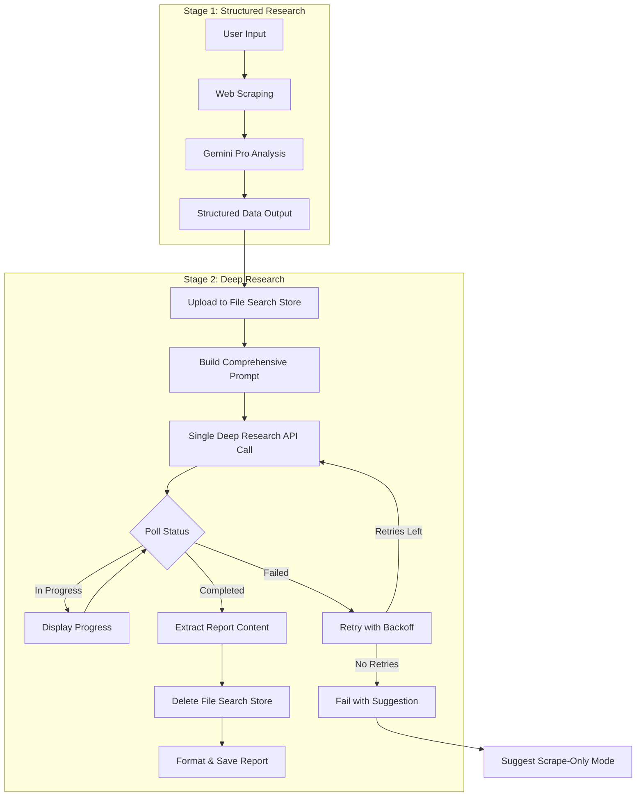

# Design Document: Cohesive Deep Research Report

## Overview

This design addresses two critical issues in report generation:

1. **Deep Research Architecture**: Transform from failing parallel-chapter approach (10 API calls, 8 fail with 429 errors, ✗ marks in output) to a single-invocation cohesive report system.

2. **Report Formatting**: Remove unprofessional memo-style formatting ("RESEARCH REQUEST", "TO:", "FROM:", "SUBJECT:") from all report outputs. Reports should be clean strategic documents, not internal memos.

### Key Architectural Change

**Before (Broken):**
```
Stage 1 → 10 parallel Deep Research calls → 8 fail → Report with ✗ marks
Output format: "RESEARCH REQUEST: ... TO: CIO ... FROM: AI Task Force"
```

**After (Correct):**
```
Stage 1 → Upload to File Search Store → 1 Deep Research call → Complete cohesive report
Output format: Clean strategic document with professional headers
```

## Architecture



## Components and Interfaces

### 1. DeepResearchOrchestrator

The main orchestrator that coordinates the single Deep Research invocation.

```python
class DeepResearchOrchestrator:
    """Orchestrates a single Deep Research API call for complete report generation."""
    
    AGENT_ID = "deep-research-pro-preview-12-2025"
    MAX_RETRIES = 5
    TIMEOUT_SECONDS = 3600  # 60 minutes
    
    async def generate_report(
        self,
        company_name: str,
        website_url: str,
        stage1_context: str,
        on_progress: Callable[[str], None] | None = None,
    ) -> DeepResearchResult:
        """
        Generate a complete strategic report using Deep Research.
        
        Args:
            company_name: Target company name
            website_url: Company website URL
            stage1_context: Structured research from Stage 1
            on_progress: Optional progress callback
            
        Returns:
            DeepResearchResult with complete report or error
        """
```

### 2. FileSearchStoreManager

Manages the lifecycle of temporary File Search Stores for context injection.

```python
class FileSearchStoreManager:
    """Manages File Search Store lifecycle for Deep Research context."""
    
    async def create_store(self, display_name: str) -> str:
        """Create a new File Search Store, returns store name."""
        
    async def upload_context(self, store_name: str, content: str, filename: str) -> None:
        """Upload structured research context to the store."""
        
    async def delete_store(self, store_name: str) -> None:
        """Delete the store after research completes (data governance)."""
```

### 3. ConsultingPromptBuilder

Builds the comprehensive prompt with consulting frameworks and all chapter requirements.

```python
class ConsultingPromptBuilder:
    """Builds consulting-grade prompts for Deep Research."""
    
    def build_comprehensive_prompt(
        self,
        company_name: str,
        website_url: str,
        store_name: str,
    ) -> str:
        """
        Build a single prompt requesting the complete 10-chapter report.
        
        Includes:
        - Consulting persona injection
        - All 10 chapter specifications
        - Hierarchy of truth instructions
        - Formatting and epistemic standards
        """
```

### 4. ReportFormatter

Formats the Deep Research output into clean deliverables without debug artifacts.

```python
class ReportFormatter:
    """Formats Deep Research output into clean report deliverables."""
    
    def format_report(
        self,
        raw_content: str,
        company_name: str,
        citation_style: str,
    ) -> FormattedReport:
        """
        Format raw Deep Research output into clean Markdown.
        
        - Removes any debug artifacts
        - Applies consistent citation formatting
        - Generates clean Table of Contents (no ✓/✗ markers)
        """
```

## Data Models

### DeepResearchResult

```python
@dataclass
class DeepResearchResult:
    """Result from Deep Research report generation."""
    
    company_name: str
    content: str  # Full report markdown
    citations: list[Citation]
    duration_seconds: float
    success: bool
    error: str | None = None
    interaction_id: str = ""
    word_count: int = 0
```

### FormattedReport

```python
@dataclass
class FormattedReport:
    """Formatted report ready for output."""
    
    markdown: str
    table_of_contents: str
    chapters: list[ChapterContent]
    citations: list[Citation]
    metadata: ReportMetadata
```

## Correctness Properties

*A property is a characteristic or behavior that should hold true across all valid executions of a system-essentially, a formal statement about what the system should do. Properties serve as the bridge between human-readable specifications and machine-verifiable correctness guarantees.*

### Property 1: Single API Call Per Report
*For any* report generation request, the system should make exactly one Deep Research API call (not multiple parallel calls).
**Validates: Requirements 3.1**

### Property 2: No Failure Markers in Output
*For any* generated report, the output should not contain failure markers (✗) or success markers (✓) in the Table of Contents.
**Validates: Requirements 1.1, 5.1**

### Property 3: Retry with Exponential Backoff
*For any* sequence of quota errors (429), the retry delays should increase exponentially (delay_n = base_delay * 2^n).
**Validates: Requirements 1.2**

### Property 4: File Search Store Cleanup
*For any* completed Deep Research operation (success or failure), the temporary File Search Store should be deleted.
**Validates: Requirements 2.4**

### Property 5: Complete Chapter Coverage
*For any* successfully generated report, the output should contain all 10 standard chapters.
**Validates: Requirements 5.2**

### Property 6: Prompt Contains All Chapters
*For any* Deep Research prompt, the prompt text should contain specifications for all 10 chapter topics.
**Validates: Requirements 3.2**

### Property 7: Consulting Persona Injection
*For any* Deep Research prompt, the prompt should contain the consulting persona text ("Senior Strategy Consultant" or equivalent).
**Validates: Requirements 6.1**

### Property 8: Scrape Mode Bypasses Deep Research
*For any* execution with mode="scrape", the Deep Research API should not be called.
**Validates: Requirements 7.1**

### Property 9: Progress Callbacks During Polling
*For any* Deep Research operation lasting more than the poll interval, progress callbacks should be invoked at regular intervals.
**Validates: Requirements 4.1**

### Property 10: Clean Output Without Debug Artifacts
*For any* saved report, the output files should not contain debug markers, stack traces, or internal error messages.
**Validates: Requirements 5.4**

### Property 11: No Memo-Style Headers
*For any* generated report, the output should not contain memo-style headers ("RESEARCH REQUEST:", "TO:", "FROM:", "SUBJECT:").
**Validates: Requirements 5.4**

## Report Formatting Standards

### Prohibited Patterns

The following patterns must NOT appear in any report output:

```
# PROHIBITED - Memo-style headers
RESEARCH REQUEST: ...
DATE: December 2025
TO: CIO, Company Name & Board of Directors
FROM: AI Strategy Task Force
SUBJECT: Strategic Roadmap...
```

### Required Format

Reports should use clean professional headers:

```markdown
# Strategic Company Overview: {Company Name}

**Prepared by:** Primr Research System  
**Date:** {Date}

---

## Executive Summary
...

## 1. Company Overview
...
```

### Files Requiring Format Updates

1. `src/primr/core/ai_strategy.py` - Remove memo-style prompt formatting
2. `src/primr/ai/deep_research.py` - Remove "RESEARCH REQUEST" headers
3. `src/primr/core/vendor_research.py` - Remove memo-style formatting
4. `src/primr/core/research_agent.py` - Remove memo-style formatting

## Error Handling

### Quota Exhaustion (429 Errors)

```python
async def _execute_with_retry(self, prompt: str) -> DeepResearchResult:
    """Execute Deep Research with exponential backoff retry."""
    base_delay = 60.0  # 1 minute base delay
    
    for attempt in range(self.MAX_RETRIES):
        try:
            return await self._execute_single(prompt)
        except QuotaExceededError:
            if attempt == self.MAX_RETRIES - 1:
                return DeepResearchResult(
                    success=False,
                    error="Deep Research quota exhausted. Try --mode scrape instead.",
                )
            delay = base_delay * (2 ** attempt)
            logger.warning(f"Quota limit, waiting {delay}s (attempt {attempt + 1})")
            await asyncio.sleep(delay)
```

### Timeout Handling

```python
async def _poll_for_completion(self, interaction_id: str) -> str:
    """Poll with adaptive intervals and timeout."""
    start = time.time()
    
    while time.time() - start < self.TIMEOUT_SECONDS:
        status = await self._get_status(interaction_id)
        
        if status == "completed":
            return await self._extract_content(interaction_id)
        elif status == "failed":
            raise DeepResearchFailedError(interaction_id)
        
        # Adaptive polling: 5s → 10s → 20s → 30s
        elapsed = time.time() - start
        interval = min(30, 5 + (elapsed // 60) * 5)
        await asyncio.sleep(interval)
    
    raise TimeoutError(f"Deep Research timed out after 60 minutes. ID: {interaction_id}")
```

## Testing Strategy

### Unit Tests

Unit tests verify specific components in isolation:

1. **PromptBuilder tests**: Verify prompt contains all required sections
2. **ReportFormatter tests**: Verify clean output without artifacts
3. **RetryLogic tests**: Verify exponential backoff timing

### Property-Based Tests

Property-based tests use Hypothesis to verify universal properties:

1. **Single API call property**: Mock API and count invocations
2. **No failure markers property**: Generate reports and check for ✗/✓
3. **Exponential backoff property**: Verify delay sequence
4. **Store cleanup property**: Verify delete called after completion
5. **Chapter coverage property**: Parse output and count chapters

### Testing Framework

- **Unit tests**: pytest
- **Property-based tests**: Hypothesis (already in use per `.hypothesis` folder)
- **Minimum iterations**: 100 per property test

### Test Annotations

Each property-based test must be annotated with:
```python
# **Feature: cohesive-deep-research-report, Property N: <property_text>**
# **Validates: Requirements X.Y**
```
