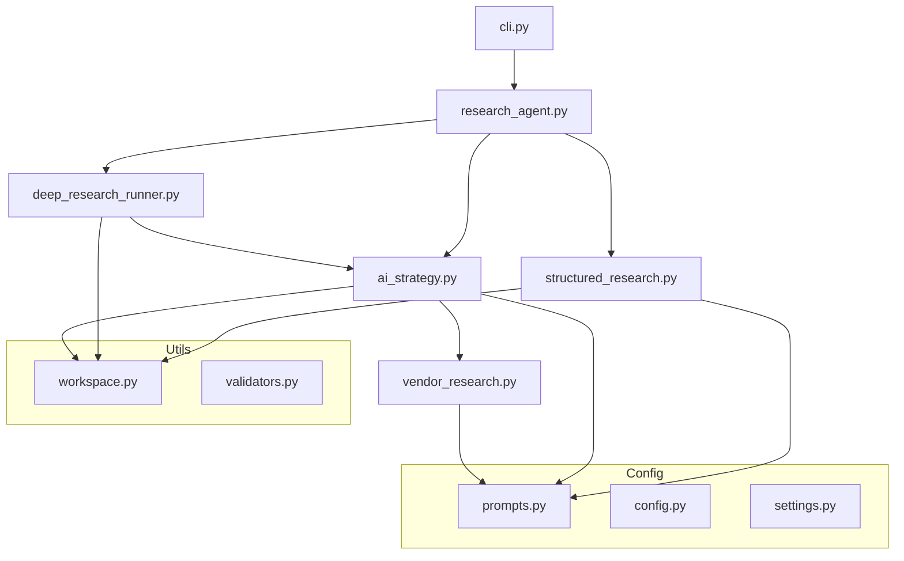

# Design Document: Research Agent Decomposition

## Overview

This design decomposes the monolithic `research_agent.py` (~2800 lines, 22 functions) into focused modules with clear responsibilities. The refactoring follows the Single Responsibility Principle, extracting logical groupings of functionality into dedicated modules while maintaining backward compatibility through re-exports.

The config module is also updated to use lazy validation, allowing imports without API keys configured, which is critical for testing.

### Design Principles

1. **Exceptional Code Quality**: Every function is crafted with intention. No shortcuts, no "good enough." The code should be a pleasure to read and maintain.

2. **Modern Python Patterns**: Type hints everywhere. Dataclasses for structured data. Context managers for resource handling. Async where it makes sense. Protocol classes for dependency injection.

3. **Premium Developer UX**: Clear error messages with actionable guidance. Progress feedback that respects the developer's time. Documentation that anticipates questions.

4. **Testability First**: Every module is designed for isolated testing. Dependencies are injectable. Side effects are contained. Mocking is straightforward.

5. **Zero Tolerance for Cruft**: No dead code. No commented-out blocks. No "TODO: fix later." If it is not needed, it is not there.

## Architecture

### Current State

```
src/primr/core/
├── research_agent.py      # 2800 lines, 22 functions - MONOLITH
├── research_orchestrator.py
├── report_models.py
└── container.py
```

### Target State

```
src/primr/core/
├── research_agent.py      # ~200 lines - orchestration + re-exports
├── structured_research.py # ~300 lines - scrape-based pipeline
├── deep_research_runner.py# ~400 lines - Deep Research execution
├── ai_strategy.py         # ~400 lines - AI strategy generation
├── vendor_research.py     # ~350 lines - vendor-specific research
├── cli.py                 # ~300 lines - CLI parsing and main()
├── workspace.py           # ~150 lines - working folder operations
├── research_orchestrator.py
├── report_models.py
└── container.py

src/primr/config/
├── config.py              # Updated - lazy validation
├── settings.py            # Already has lazy validation
└── prompts.py             # NEW - prompt generation utilities
```

### Module Dependency Graph



## Components and Interfaces

### 1. cli.py - Command Line Interface

**Responsibility:** Argument parsing, entry point, and command dispatch.

**Design Philosophy:** The CLI is the first impression. It should feel responsive, informative, and never leave the user wondering what is happening.

```python
from dataclasses import dataclass
from enum import Enum
from typing import Protocol

class Command(str, Enum):
    """CLI commands with clear semantics."""
    RESEARCH = "research"
    DOCTOR = "doctor"
    CHECK_JOBS = "check-jobs"
    CHECK_QUOTA = "check-quota"
    CLEAN = "clean"

@dataclass(frozen=True)
class CLIConfig:
    """Immutable CLI configuration parsed from arguments."""
    command: Command
    company_name: str | None
    website: str | None
    mode: str
    citation_style: str
    cloud_vendor: str
    ai_strategy: bool
    confirm: bool
    dry_run: bool
    verbose: bool
    quiet: bool
    csv_path: str | None

class CLIRunner(Protocol):
    """Protocol for command execution, enabling testing."""
    def run(self, config: CLIConfig) -> int: ...

# Public Interface
def main(args: list[str] | None = None, runner: CLIRunner | None = None) -> int:
    """
    Main CLI entry point.
    
    Returns exit code (0 = success, 1 = error, 2 = user cancelled).
    Accepts optional runner for testing.
    """

def parse_args(args: list[str] | None = None) -> CLIConfig:
    """Parse command line arguments into typed configuration."""

def run_doctor(quiet: bool = False) -> bool:
    """
    Run system diagnostics.
    
    Returns True if all checks pass, False otherwise.
    Prints detailed results unless quiet=True.
    """

def process_csv(file_path: str, config: CLIConfig) -> list[str]:
    """
    Process batch CSV input.
    
    Returns list of generated report paths.
    """
```

**Modern Patterns Used:**
- Frozen dataclass for immutable config
- Enum for command types
- Protocol for dependency injection
- Return codes for scripting integration

### 2. research_agent.py - Orchestration Hub

**Responsibility:** High-level orchestration and backward-compatible re-exports.

**Design Philosophy:** This module is the conductor, not the orchestra. It coordinates but does not implement. Every function call here should be a clear delegation.

```python
from dataclasses import dataclass
from typing import Protocol

@dataclass(frozen=True)
class ResearchConfig:
    """Immutable research configuration."""
    company_name: str
    website: str | None
    mode: str
    citation_style: str
    ai_strategy: bool
    cloud_vendor: str
    context_files: tuple[str, ...] | None
    refresh_vendor_research: bool

@dataclass
class ResearchResult:
    """Result of a research operation."""
    success: bool
    output_path: str | None
    ai_strategy_path: str | None
    duration_seconds: float
    error: str | None = None

class ResearchRunner(Protocol):
    """Protocol for research execution strategies."""
    def run(self, config: ResearchConfig) -> ResearchResult: ...

# Public Interface
def perform_research(
    company_name: str | None = None,
    website: str | None = None,
    mode: str = "structured",
    citation_style: str = "numbered",
    ai_strategy: bool = False,
    cloud_vendor: str = "agnostic",
    skip_confirm: bool = False,
    context_files: list[str] | None = None,
    refresh_vendor_research: bool = False
) -> str | None:
    """
    Main research entry point.
    
    Validates inputs, selects appropriate runner, and delegates execution.
    Returns path to generated report, or None on failure.
    """

def get_runner(mode: str) -> ResearchRunner:
    """Get the appropriate runner for the research mode."""

# Re-exports for backward compatibility (explicit is better than implicit)
from primr.core.structured_research import run_research, research_section
from primr.core.workspace import create_working_folder, consolidate_working_folder
from primr.core.cli import main, run_doctor

__all__ = [
    "perform_research",
    "run_research",
    "research_section",
    "create_working_folder",
    "consolidate_working_folder",
    "main",
    "run_doctor",
    "ResearchConfig",
    "ResearchResult",
]
```

**Modern Patterns Used:**
- Frozen dataclass for immutable config
- Result dataclass for structured returns
- Protocol for strategy pattern
- Explicit `__all__` for public API

### 3. structured_research.py - Scrape-Based Pipeline

**Responsibility:** Website scraping, section analysis, and structured report generation.

**Design Philosophy:** Each phase is a pure transformation. Data flows in, results flow out. Side effects (file I/O, API calls) are isolated and explicit.

```python
from dataclasses import dataclass, field
from typing import Callable, Protocol
from contextlib import contextmanager

@dataclass
class ScrapedData:
    """Container for scraped content with metadata."""
    website_pages: dict[str, str] = field(default_factory=dict)
    external_sources: dict[str, str] = field(default_factory=dict)
    
    @property
    def all_content(self) -> dict[str, str]:
        return {**self.website_pages, **self.external_sources}
    
    @property
    def page_count(self) -> int:
        return len(self.website_pages)
    
    @property
    def source_count(self) -> int:
        return len(self.external_sources)

@dataclass
class AnalysisResult:
    """Result of content analysis phase."""
    summarized_content: str
    industry: str
    overview: str

@dataclass
class ResearchContext:
    """Immutable context passed through the pipeline."""
    company_name: str
    website: str | None
    folder_path: str
    industry: str
    overview: str
    summarized_insights: str

class ProgressReporter(Protocol):
    """Protocol for progress reporting, enabling custom UX."""
    def report(self, message: str) -> None: ...
    def phase_start(self, phase: int, total: int, name: str) -> None: ...
    def phase_complete(self, name: str, stats: dict[str, str] | None = None) -> None: ...

# Public Interface
def run_research(
    company_name: str,
    website: str,
    on_progress: Callable[[str], None] | None = None,
    reporter: ProgressReporter | None = None
) -> dict[str, str]:
    """
    Run structured research pipeline.
    
    Executes three phases:
    1. Data Collection: Scrape website and external sources
    2. Analysis: Summarize content and identify industry
    3. Section Generation: Build all report sections
    
    Returns dict mapping section_key to content.
    """

def research_section(
    section_name: str,
    context: ResearchContext
) -> str:
    """
    Research a single report section.
    
    Uses AI to generate section content based on context.
    Applies quality grading and refinement if needed.
    """

@contextmanager
def research_pipeline(company_name: str, website: str):
    """
    Context manager for research pipeline.
    
    Handles setup, cleanup, and error recovery.
    Yields ResearchContext for use in pipeline stages.
    """

# Phase functions (internal, but well-documented)
def _collect_data(
    company_name: str,
    website: str | None,
    reporter: ProgressReporter | None = None
) -> ScrapedData:
    """
    Phase 1: Data Collection.
    
    Scrapes company website (up to 15 pages) and external sources.
    Returns structured ScrapedData container.
    """

def _analyze_content(
    company_name: str,
    website: str | None,
    scraped: ScrapedData,
    folder_path: str,
    reporter: ProgressReporter | None = None
) -> AnalysisResult:
    """
    Phase 2: Content Analysis.
    
    Summarizes scraped content, identifies industry,
    and generates initial company overview.
    """

def _generate_sections(
    context: ResearchContext,
    reporter: ProgressReporter | None = None
) -> dict[str, str]:
    """
    Phase 3: Section Generation.
    
    Generates all report sections using AI.
    Applies quality grading and refinement.
    """
```

**Modern Patterns Used:**
- Dataclasses with computed properties
- Protocol for progress reporting abstraction
- Context manager for pipeline lifecycle
- Immutable context object for thread safety

### 4. deep_research_runner.py - Deep Research Execution

**Responsibility:** Gemini Deep Research Agent execution and result processing.

**Design Philosophy:** Deep Research is expensive and slow. Every operation should be validated before execution. Failures should be graceful and informative.

```python
from dataclasses import dataclass, field
from enum import Enum
from typing import Callable, Protocol
from contextlib import asynccontextmanager

class PreflightStatus(str, Enum):
    """Pre-flight check status."""
    PASS = "pass"
    WARN = "warn"
    FAIL = "fail"

@dataclass
class PreflightCheck:
    """Result of a single pre-flight check."""
    name: str
    status: PreflightStatus
    message: str
    guidance: str | None = None

@dataclass
class PreflightResult:
    """Aggregated pre-flight validation result."""
    checks: list[PreflightCheck] = field(default_factory=list)
    
    @property
    def passed(self) -> bool:
        return all(c.status != PreflightStatus.FAIL for c in self.checks)
    
    @property
    def failures(self) -> list[PreflightCheck]:
        return [c for c in self.checks if c.status == PreflightStatus.FAIL]
    
    @property
    def warnings(self) -> list[PreflightCheck]:
        return [c for c in self.checks if c.status == PreflightStatus.WARN]

@dataclass
class DeepResearchConfig:
    """Configuration for Deep Research execution."""
    company_name: str
    website: str | None
    mode: str
    context_files: tuple[str, ...] | None
    citation_style: str
    ai_strategy: bool
    cloud_vendor: str
    refresh_vendor_research: bool

@dataclass
class DeepResearchResult:
    """Result of Deep Research execution."""
    success: bool
    raw_content: str | None
    section_results: dict[str, str]
    citations: list[str]
    duration_seconds: float
    output_path: str | None
    ai_strategy_path: str | None
    error: str | None = None
    cost_estimate: float = 0.0

class DeepResearchProgress(Protocol):
    """Protocol for Deep Research progress updates."""
    def on_start(self, config: DeepResearchConfig) -> None: ...
    def on_progress(self, message: str) -> None: ...
    def on_phase(self, phase: str, description: str) -> None: ...
    def on_complete(self, result: DeepResearchResult) -> None: ...
    def on_error(self, error: str) -> None: ...

# Public Interface
async def perform_deep_research(
    config: DeepResearchConfig,
    progress: DeepResearchProgress | None = None
) -> DeepResearchResult:
    """
    Execute Deep Research mode.
    
    Performs pre-flight validation, executes research,
    processes results, and generates output documents.
    
    This is an async function to properly handle the
    long-running Deep Research API calls.
    """

def perform_deep_research_sync(
    config: DeepResearchConfig,
    progress: DeepResearchProgress | None = None
) -> DeepResearchResult:
    """
    Synchronous wrapper for perform_deep_research.
    
    Creates event loop if needed. Use this from synchronous code.
    """

def validate_preflight(config: DeepResearchConfig) -> PreflightResult:
    """
    Pre-flight validation before expensive API calls.
    
    Checks:
    - Company name or website provided
    - Context files exist and are readable
    - API key is configured
    - Output directory is writable
    
    Returns PreflightResult with detailed check results.
    """

@asynccontextmanager
async def deep_research_session(config: DeepResearchConfig):
    """
    Async context manager for Deep Research session.
    
    Handles:
    - Pre-flight validation
    - Resource allocation
    - Cleanup on success or failure
    - Usage tracking
    """

# Internal functions
async def _execute_research(
    config: DeepResearchConfig,
    progress: DeepResearchProgress | None = None
) -> tuple[str, list[str]]:
    """Execute the Deep Research query and return raw content + citations."""

def _process_results(
    raw_content: str,
    citations: list[str],
    config: DeepResearchConfig
) -> dict[str, str]:
    """Parse raw content into section results."""

def _generate_outputs(
    raw_content: str,
    section_results: dict[str, str],
    config: DeepResearchConfig
) -> tuple[str | None, str | None]:
    """Generate DOCX and optional AI strategy outputs."""
```

**Modern Patterns Used:**
- Async/await for long-running operations
- Dataclass with computed properties for validation results
- Async context manager for session lifecycle
- Protocol for progress abstraction
- Enum for status values

### 5. ai_strategy.py - AI Strategy Generation

**Responsibility:** Board-level AI roadmap generation using Deep Research.

**Design Philosophy:** AI strategy is the crown jewel output. The prompts are carefully crafted, the context is curated, and the output is polished. This is where Primr delivers its highest value.

```python
from dataclasses import dataclass, field
from enum import Enum
from pathlib import Path
from typing import Protocol

class CloudVendor(str, Enum):
    """Supported cloud vendors for AI strategy."""
    AZURE = "azure"
    AWS = "aws"
    GCP = "gcp"
    AGNOSTIC = "agnostic"
    
    @property
    def display_name(self) -> str:
        names = {
            "azure": "Microsoft Azure",
            "aws": "Amazon Web Services",
            "gcp": "Google Cloud Platform",
            "agnostic": "Cloud-Agnostic"
        }
        return names[self.value]

@dataclass(frozen=True)
class AIStrategyConfig:
    """Configuration for AI strategy generation."""
    company_name: str
    cloud_vendor: CloudVendor
    company_research_path: Path | None = None
    force_refresh_vendor: bool = False
    
    def __post_init__(self):
        if isinstance(self.cloud_vendor, str):
            object.__setattr__(self, 'cloud_vendor', CloudVendor(self.cloud_vendor.lower()))

@dataclass
class AIStrategyResult:
    """Result of AI strategy generation."""
    success: bool
    content: str | None
    output_path: Path | None
    vendor_research_paths: tuple[Path, ...]
    duration_seconds: float
    error: str | None = None

@dataclass
class StrategyPromptContext:
    """Context for building AI strategy prompts."""
    company_name: str
    cloud_vendor: CloudVendor
    current_date: str
    vendor_capabilities: str
    company_context: str | None

class StrategyPromptBuilder(Protocol):
    """Protocol for strategy prompt construction."""
    def build(self, context: StrategyPromptContext) -> str: ...

# Public Interface
async def generate_ai_strategy(
    config: AIStrategyConfig,
    on_progress: callable | None = None
) -> AIStrategyResult:
    """
    Generate AI strategy document.
    
    Orchestrates:
    1. Vendor research retrieval/generation
    2. Company context loading
    3. Strategy prompt construction
    4. Deep Research execution
    5. Output generation (MD, TXT, DOCX)
    
    Returns AIStrategyResult with paths to generated files.
    """

def generate_ai_strategy_sync(
    config: AIStrategyConfig,
    on_progress: callable | None = None
) -> AIStrategyResult:
    """Synchronous wrapper for generate_ai_strategy."""

def build_strategy_prompt(context: StrategyPromptContext) -> str:
    """
    Build the Deep Research prompt for AI strategy.
    
    The prompt is carefully structured to produce:
    - Executive summary with confidence levels
    - AI-enabled vs AI-native distinction
    - Prioritized use cases with ROI framing
    - Governance and risk considerations
    - Implementation roadmap
    """

def get_prompt_builder(cloud_vendor: CloudVendor) -> StrategyPromptBuilder:
    """Get vendor-specific prompt builder."""

# Internal functions
async def _gather_context(
    config: AIStrategyConfig,
    on_progress: callable | None = None
) -> StrategyPromptContext:
    """Gather all context needed for strategy generation."""

async def _execute_strategy_research(
    prompt: str,
    context_files: list[Path]
) -> str | None:
    """Execute Deep Research for AI strategy."""

def _save_strategy_outputs(
    content: str,
    config: AIStrategyConfig
) -> Path:
    """Save strategy to MD, TXT, and DOCX formats."""
```

**Modern Patterns Used:**
- Enum with computed property for display names
- Frozen dataclass with post_init validation
- Protocol for prompt builder abstraction
- Async/await for long-running operations
- Path objects instead of strings

### 6. vendor_research.py - Vendor-Specific Research

**Responsibility:** Cloud vendor AI capabilities research generation and caching.

**Design Philosophy:** Vendor research is expensive to generate but valuable to cache. The module manages a simple file-based cache with monthly expiration, preferring manually curated files when available.

```python
from dataclasses import dataclass
from datetime import datetime
from pathlib import Path
from typing import Protocol

@dataclass(frozen=True)
class VendorResearchFile:
    """Metadata about a vendor research file."""
    path: Path
    vendor: str
    month: str
    is_manual: bool
    
    @property
    def exists(self) -> bool:
        return self.path.exists()
    
    @property
    def age_days(self) -> int:
        if not self.exists:
            return -1
        mtime = datetime.fromtimestamp(self.path.stat().st_mtime)
        return (datetime.now() - mtime).days

@dataclass
class VendorResearchResult:
    """Result of vendor research retrieval/generation."""
    files: tuple[VendorResearchFile, ...]
    generated: bool
    duration_seconds: float
    error: str | None = None
    
    @property
    def paths(self) -> list[Path]:
        return [f.path for f in self.files if f.exists]

class VendorPromptBuilder(Protocol):
    """Protocol for vendor-specific prompt construction."""
    def build(self, vendor: str, current_date: str) -> str: ...

# Public Interface
async def get_or_generate_vendor_research(
    vendor: str,
    force_refresh: bool = False,
    on_progress: callable | None = None
) -> VendorResearchResult:
    """
    Get vendor research files, generating if needed.
    
    Priority order:
    1. Manually curated files (e.g., Ignite analysis for Azure)
    2. Current month's auto-generated research
    3. Generate fresh research if nothing available
    
    Returns VendorResearchResult with file paths.
    """

def get_or_generate_vendor_research_sync(
    vendor: str,
    force_refresh: bool = False,
    on_progress: callable | None = None
) -> VendorResearchResult:
    """Synchronous wrapper for get_or_generate_vendor_research."""

async def generate_vendor_research(
    vendor: str,
    on_progress: callable | None = None
) -> VendorResearchFile | None:
    """
    Generate fresh vendor AI research using Deep Research.
    
    Creates comprehensive overview of latest AI services
    and capabilities for the specified cloud vendor.
    """

def is_vendor_research_current(vendor: str) -> bool:
    """Check if current month's vendor research exists."""

def get_vendor_research_path(vendor: str, month: str | None = None) -> Path:
    """
    Get path for vendor research file.
    
    Uses current month if month not specified.
    """

def get_manual_research_path(vendor: str) -> Path | None:
    """Get path to manually curated research file if it exists."""

# Internal functions
def _build_vendor_prompt(vendor: str) -> str:
    """
    Build Deep Research prompt for vendor research.
    
    The prompt is structured to produce:
    - Executive summary of vendor AI direction
    - Service map with current names and status
    - Foundation models and customization options
    - Agentic AI and automation capabilities
    - Security and governance tools
    - Recent announcements and deprecations
    """

def _get_vendor_metadata(vendor: str) -> dict[str, str]:
    """Get vendor-specific metadata (conferences, platforms, etc.)."""
```

**Modern Patterns Used:**
- Frozen dataclass with computed properties
- Path objects for file handling
- Protocol for prompt builder abstraction
- Async/await for generation
- Clear priority order in retrieval logic

### 7. workspace.py - Working Folder Operations

**Responsibility:** Working folder creation, consolidation, and file operations.

**Design Philosophy:** File operations should be atomic, safe, and predictable. Every function handles edge cases gracefully and provides clear feedback on what happened.

```python
from dataclasses import dataclass, field
from pathlib import Path
from typing import Iterator
from contextlib import contextmanager

@dataclass(frozen=True)
class WorkspaceConfig:
    """Configuration for workspace operations."""
    base_dir: Path
    company_name: str
    website: str | None = None
    
    @property
    def folder_name(self) -> str:
        """Derive folder name from company name or website."""
        if self.company_name:
            return self.company_name.replace(" ", "_")
        if self.website:
            from urllib.parse import urlparse
            netloc = urlparse(self.website).netloc
            return netloc.replace("www.", "").replace(".", "_")
        return "Unknown_Company"
    
    @property
    def folder_path(self) -> Path:
        return self.base_dir / self.folder_name

@dataclass
class ConsolidationResult:
    """Result of folder consolidation."""
    output_path: Path
    files_processed: int
    total_size_bytes: int
    sections: list[str]

@dataclass
class FileValidationResult:
    """Result of file validation."""
    valid_files: tuple[Path, ...]
    invalid_files: tuple[tuple[Path, str], ...]  # (path, reason)
    warnings: tuple[str, ...]
    
    @property
    def all_valid(self) -> bool:
        return len(self.invalid_files) == 0

# Supported file types for Deep Research
SUPPORTED_EXTENSIONS: frozenset[str] = frozenset({'.txt', '.pdf', '.md', '.json', '.csv'})

# Public Interface
def create_working_folder(config: WorkspaceConfig) -> Path:
    """
    Create working folder for research artifacts.
    
    Creates the folder if it does not exist.
    Returns the Path to the created folder.
    """

def create_working_folder_simple(
    company_name: str | None,
    website: str | None,
    base_dir: Path | None = None
) -> Path:
    """
    Simplified interface for backward compatibility.
    
    Uses default base_dir from settings if not provided.
    """

@contextmanager
def working_folder(config: WorkspaceConfig) -> Iterator[Path]:
    """
    Context manager for working folder operations.
    
    Creates folder on entry, optionally cleans up on exit.
    Yields the folder path for use in the context.
    """

def consolidate_working_folder(folder_path: Path) -> ConsolidationResult:
    """
    Consolidate .txt files into single context file.
    
    Reads all .txt files in the folder, combines them
    with section headers, and writes to a temp file.
    
    Returns ConsolidationResult with output path and stats.
    """

def save_section_output(
    folder_path: Path,
    section_key: str,
    content: str
) -> Path:
    """
    Save section content to file.
    
    Writes content to {folder_path}/{section_key}.txt.
    Creates parent directories if needed.
    Returns path to the saved file.
    """

def validate_context_files(file_paths: list[Path | str]) -> FileValidationResult:
    """
    Validate context files for Deep Research upload.
    
    Checks:
    - File exists
    - File is readable
    - Extension is supported
    - File is not empty
    
    Returns FileValidationResult with categorized results.
    """

def list_section_files(folder_path: Path) -> list[Path]:
    """List all .txt section files in a working folder."""

def get_section_content(folder_path: Path, section_key: str) -> str | None:
    """Read content of a specific section file."""
```

**Modern Patterns Used:**
- Frozen dataclass with computed properties
- Path objects throughout
- Context manager for folder lifecycle
- Frozenset for immutable constants
- Structured result types

### 8. config/prompts.py - Prompt Generation

**Responsibility:** Prompt template loading and generation.

**Design Philosophy:** Prompts are the soul of Primr. They should be easy to find, easy to modify, and impossible to break accidentally. The module provides type-safe access with clear error messages.

```python
from dataclasses import dataclass
from pathlib import Path
from typing import Any
import json

@dataclass(frozen=True)
class PromptTemplate:
    """A single prompt template with metadata."""
    name: str
    template: str
    required_vars: frozenset[str]
    description: str | None = None
    
    def render(self, **kwargs: Any) -> str:
        """
        Render template with provided variables.
        
        Raises PromptError if required variables are missing.
        """
        missing = self.required_vars - set(kwargs.keys())
        if missing:
            raise PromptError(
                f"Missing required variables for '{self.name}': {', '.join(sorted(missing))}"
            )
        return self.template.format(**kwargs)

class PromptError(Exception):
    """Raised when prompt generation fails."""
    pass

class PromptRegistry:
    """
    Registry of prompt templates with lazy loading.
    
    Thread-safe singleton that loads prompts on first access.
    """
    _instance: 'PromptRegistry | None' = None
    _prompts: dict[str, PromptTemplate] | None = None
    
    def __new__(cls) -> 'PromptRegistry':
        if cls._instance is None:
            cls._instance = super().__new__(cls)
        return cls._instance
    
    def get(self, name: str) -> PromptTemplate:
        """Get a prompt template by name."""
        self._ensure_loaded()
        if name not in self._prompts:
            available = ', '.join(sorted(self._prompts.keys()))
            raise PromptError(
                f"Prompt '{name}' not found. Available: {available}"
            )
        return self._prompts[name]
    
    def render(self, name: str, **kwargs: Any) -> str:
        """Render a prompt template with variables."""
        return self.get(name).render(**kwargs)
    
    def list_prompts(self) -> list[str]:
        """List all available prompt names."""
        self._ensure_loaded()
        return sorted(self._prompts.keys())
    
    def _ensure_loaded(self) -> None:
        """Load prompts if not already loaded."""
        if self._prompts is None:
            self._prompts = _load_prompts_from_file()
    
    def reload(self) -> None:
        """Force reload prompts from file."""
        self._prompts = _load_prompts_from_file()

# Public Interface
def get_registry() -> PromptRegistry:
    """Get the prompt registry singleton."""
    return PromptRegistry()

def generate_prompt(template_name: str, **kwargs: Any) -> str:
    """
    Generate prompt from template with substitutions.
    
    This is the primary interface for prompt generation.
    Raises PromptError if template not found or variables missing.
    """
    return get_registry().render(template_name, **kwargs)

def list_prompts() -> list[str]:
    """List all available prompt template names."""
    return get_registry().list_prompts()

def get_prompt_template(name: str) -> PromptTemplate:
    """Get a prompt template by name for inspection."""
    return get_registry().get(name)

# Internal functions
def _load_prompts_from_file() -> dict[str, PromptTemplate]:
    """Load prompts from prompts.json and parse into templates."""
    prompts_file = Path(__file__).parent / "prompts.json"
    
    if not prompts_file.exists():
        raise PromptError(f"Prompts file not found: {prompts_file}")
    
    with open(prompts_file, encoding="utf-8") as f:
        raw_prompts = json.load(f)
    
    templates = {}
    for name, template_str in raw_prompts.items():
        # Extract required variables from template
        required_vars = _extract_template_vars(template_str)
        templates[name] = PromptTemplate(
            name=name,
            template=template_str,
            required_vars=frozenset(required_vars)
        )
    
    return templates

def _extract_template_vars(template: str) -> set[str]:
    """Extract variable names from a format string template."""
    import re
    return set(re.findall(r'\{(\w+)\}', template))
```

**Modern Patterns Used:**
- Frozen dataclass for immutable templates
- Thread-safe singleton registry
- Lazy loading with explicit reload
- Clear error messages with available options
- Automatic variable extraction from templates

### 9. config/config.py - Updated Configuration

**Responsibility:** Configuration constants with lazy API key validation.

**Design Philosophy:** Configuration should never prevent imports. Validation happens when values are used, not when modules are loaded. Error messages should tell you exactly what to do.

```python
import os
from dataclasses import dataclass
from pathlib import Path
from typing import Any

from dotenv import load_dotenv

from primr.utils.errors import ConfigurationError

# Load environment variables (safe, no validation)
load_dotenv()

# =============================================================================
# LAZY API KEY ACCESS
# =============================================================================

# Private storage (loaded but not validated at import time)
_gemini_api_key: str | None = os.getenv("GEMINI_API_KEY")
_search_api_key: str | None = os.getenv("SEARCH_API_KEY")
_search_engine_id: str | None = os.getenv("SEARCH_ENGINE_ID")

def get_gemini_api_key() -> str:
    """
    Get Gemini API key, raising if not configured.
    
    Raises:
        ConfigurationError: If GEMINI_API_KEY is not set in environment or .env
    """
    if not _gemini_api_key:
        raise ConfigurationError(
            "GEMINI_API_KEY not configured",
            guidance="Add GEMINI_API_KEY=your_key to your .env file or environment"
        )
    return _gemini_api_key

def get_search_api_key() -> str:
    """
    Get Google Search API key, raising if not configured.
    
    Raises:
        ConfigurationError: If SEARCH_API_KEY is not set
    """
    if not _search_api_key:
        raise ConfigurationError(
            "SEARCH_API_KEY not configured",
            guidance="Add SEARCH_API_KEY=your_key to your .env file or environment"
        )
    return _search_api_key

def get_search_engine_id() -> str:
    """
    Get Google Search Engine ID, raising if not configured.
    
    Raises:
        ConfigurationError: If SEARCH_ENGINE_ID is not set
    """
    if not _search_engine_id:
        raise ConfigurationError(
            "SEARCH_ENGINE_ID not configured",
            guidance="Add SEARCH_ENGINE_ID=your_id to your .env file or environment"
        )
    return _search_engine_id

# =============================================================================
# EXPLICIT VALIDATION
# =============================================================================

@dataclass
class ConfigValidationResult:
    """Result of configuration validation."""
    valid: bool
    errors: tuple[str, ...]
    warnings: tuple[str, ...]

def validate_config(include_optional: bool = False) -> ConfigValidationResult:
    """
    Explicitly validate all required configuration.
    
    Call this at application startup (e.g., in main() or doctor command)
    to fail fast with clear error messages.
    
    Args:
        include_optional: If True, also check optional config values
    
    Returns:
        ConfigValidationResult with validation status and any errors
    """
    errors = []
    warnings = []
    
    # Required API keys
    if not _gemini_api_key:
        errors.append("GEMINI_API_KEY not set")
    if not _search_api_key:
        errors.append("SEARCH_API_KEY not set")
    if not _search_engine_id:
        errors.append("SEARCH_ENGINE_ID not set")
    
    # Check directories are writable
    for dir_name, dir_path in [
        ("OUTPUT_DIR", OUTPUT_DIR),
        ("WORKING_DIR", WORKING_DIR),
        ("LOGS_DIR", LOGS_DIR),
    ]:
        path = Path(dir_path)
        if not path.exists():
            try:
                path.mkdir(parents=True, exist_ok=True)
            except OSError as e:
                errors.append(f"{dir_name} cannot be created: {e}")
        elif not os.access(path, os.W_OK):
            errors.append(f"{dir_name} is not writable: {path}")
    
    return ConfigValidationResult(
        valid=len(errors) == 0,
        errors=tuple(errors),
        warnings=tuple(warnings)
    )

def require_valid_config() -> None:
    """
    Require valid configuration, raising if invalid.
    
    Use this as a guard at the start of operations that need config.
    """
    result = validate_config()
    if not result.valid:
        raise ConfigurationError(
            "Configuration validation failed",
            guidance="Errors:\n  - " + "\n  - ".join(result.errors)
        )

# =============================================================================
# BACKWARD COMPATIBLE CONSTANTS
# =============================================================================

# These are still available for backward compatibility,
# but code should migrate to using get_*() functions

# Project paths (safe, no validation needed)
def get_project_root() -> Path:
    """Get project root directory."""
    current = Path(__file__).resolve()
    for _ in range(4):
        current = current.parent
        if (current / ".env").exists() or (current / "pyproject.toml").exists():
            return current
    return Path.cwd()

PROJECT_ROOT = get_project_root()
OUTPUT_DIR = str(PROJECT_ROOT / "output")
WORKING_DIR = str(PROJECT_ROOT / "working")
LOGS_DIR = str(PROJECT_ROOT / "logs" / "chat_history")

# Ensure directories exist (safe operation)
for directory in [OUTPUT_DIR, WORKING_DIR, LOGS_DIR]:
    Path(directory).mkdir(parents=True, exist_ok=True)

# Non-sensitive configuration (safe to access at import time)
NUM_SEARCH_RESULTS = 3
PARALLEL_SEARCH_LIMIT = 2
INITIAL_RETRY_DELAY = 5
MAX_SCRAPE_RETRIES = 2
SCRAPE_TIMEOUT = 15
SCRAPE_MAX_DEPTH = 2
EXCLUDED_SITES = ["login", "captcha", "privacy-policy", "terms-of-service"]
AI_RESEARCH_MODEL = os.getenv("AI_RESEARCH_MODEL", "gemini-3-pro-preview")
AI_REPORT_MODEL = os.getenv("AI_REPORT_MODEL", "gemini-3-pro-preview")
MAX_RETRIES = 3
GRADE_THRESHOLD_FOR_RESEARCH_REFINEMENT = 80
SUPPORTED_FILE_TYPES = [".pdf", ".docx", ".txt", ".xlsx"]
CONVERT_TO_PDF = True

# REMOVED: Import-time validation that was causing test failures
# if not GEMINI_API_KEY:
#     raise ValueError("[ERROR] Missing Gemini API Key in .env")
```

**Key Changes:**
1. API keys loaded but not validated at import time
2. Lazy accessor functions that validate on use
3. Explicit `validate_config()` for startup validation
4. `require_valid_config()` guard for operations
5. Clear error messages with actionable guidance
6. Backward compatible constants still available

## Data Models

No new data models are introduced. Existing types from `types.py` are used:

- `ResearchContext` - Context passed through pipeline
- `SearchResult` - Search results
- `ScrapedContent` - Scraped page content
- `ReportSection` - Report section data

## Correctness Properties

*A property is a characteristic or behavior that should hold true across all valid executions of a system—essentially, a formal statement about what the system should do. Properties serve as the bridge between human-readable specifications and machine-verifiable correctness guarantees.*

### Property 1: Module import compatibility
*For any* import of research_agent.py in an environment without API keys configured, the import SHALL succeed without raising exceptions, and all previously public symbols SHALL be accessible.
**Validates: Requirements 1.1, 3.1, 3.3, 5.2, 5.3**

### Property 2: Lazy API key validation
*For any* access to an API key property when the key is not configured, the System SHALL raise ConfigurationError. *For any* access when the key is configured, the System SHALL return the key value.
**Validates: Requirements 3.2**

### Property 3: Function size constraint
*For any* function in the new modules (structured_research.py, deep_research_runner.py, ai_strategy.py, vendor_research.py, workspace.py, cli.py), the function body SHALL NOT exceed 50 lines of code.
**Validates: Requirements 2.5**

### Property 4: Module independence
*For any* new module, importing it SHALL succeed without circular import errors, type imports SHALL come from types.py, configuration access SHALL use get_settings() or the new lazy config functions, and inter-module communication SHALL use function parameters and return values rather than global state.
**Validates: Requirements 6.1, 6.2, 6.3, 6.4**

### Property 5: Test suite preservation
*For any* test in the existing test suite, the test SHALL pass after refactoring without modification to the test code.
**Validates: Requirements 5.1**

## Error Handling

Error handling patterns remain unchanged:

1. **Pre-flight validation** - Validate inputs before expensive operations
2. **ConfigurationError** - Raised for missing/invalid configuration
3. **ResearchError hierarchy** - Used for operation-specific errors
4. **Graceful degradation** - Return None on failure with logged error

The lazy config validation introduces one change:
- Import-time errors become access-time errors for API keys
- This is intentional to enable testing without API keys

## Testing Strategy

### Testing Philosophy

Tests are not an afterthought. They are the specification made executable. Every test should:
1. Document expected behavior clearly
2. Fail with informative messages
3. Run fast enough to run constantly
4. Be independent and deterministic

### Dual Testing Approach

Both unit tests and property-based tests are used:

- **Unit tests** verify specific examples, edge cases, and error conditions
- **Property-based tests** verify universal properties that should hold across all inputs
- Together they provide comprehensive coverage: unit tests catch concrete bugs, property tests verify general correctness

### Property-Based Testing Library

**Library:** Hypothesis (already used in the project based on `.hypothesis` directory)

**Configuration:**
- Minimum 100 iterations per property test
- Explicit seed for reproducibility
- Deadline disabled for slow operations
- Database for example storage

```python
from hypothesis import given, settings, Verbosity
from hypothesis import strategies as st

@settings(
    max_examples=100,
    deadline=None,
    verbosity=Verbosity.verbose,
    database=None  # Use default file-based database
)
@given(st.text(min_size=1))
def test_property_example(value: str) -> None:
    """Example property test structure."""
    pass
```

### Test Categories

1. **Import Tests** - Verify modules import without errors, no API keys needed
2. **Backward Compatibility Tests** - Verify old import paths still work
3. **Function Delegation Tests** - Verify orchestration delegates correctly
4. **Config Lazy Validation Tests** - Verify lazy validation behavior
5. **Module Independence Tests** - Verify no circular imports, proper patterns
6. **Integration Tests** - Verify end-to-end research still works

### Property Test Annotations

Each property-based test will be tagged with:
```python
# **Feature: research-agent-decomposition, Property 1: Module import compatibility**
# **Validates: Requirements 1.1, 3.1, 3.3, 5.2, 5.3**
```

### Test File Structure

```
tests/
├── core/
│   ├── test_research_agent_imports.py    # Property 1: Import compatibility
│   ├── test_structured_research.py       # Unit tests for structured pipeline
│   ├── test_deep_research_runner.py      # Unit tests for deep research
│   ├── test_ai_strategy.py               # Unit tests for AI strategy
│   ├── test_vendor_research.py           # Unit tests for vendor research
│   ├── test_workspace.py                 # Unit tests for workspace ops
│   ├── test_cli.py                       # Unit tests for CLI
│   └── test_module_independence.py       # Property 4: Module independence
├── config/
│   ├── test_config_lazy.py               # Property 2: Lazy validation
│   └── test_prompts.py                   # Unit tests for prompt registry
└── properties/
    └── test_function_size.py             # Property 3: Function size constraint
```

### Test Implementation Guidelines

**For Property 1 (Module Import Compatibility):**
```python
# **Feature: research-agent-decomposition, Property 1: Module import compatibility**
# **Validates: Requirements 1.1, 3.1, 3.3, 5.2, 5.3**

import subprocess
import sys

def test_import_without_api_keys():
    """Importing research_agent.py should succeed without API keys."""
    # Run import in subprocess with clean environment
    result = subprocess.run(
        [sys.executable, "-c", "from primr.core.research_agent import perform_research"],
        env={},  # Clean environment, no API keys
        capture_output=True
    )
    assert result.returncode == 0, f"Import failed: {result.stderr.decode()}"

def test_public_symbols_exported():
    """All previously public symbols should be accessible."""
    from primr.core import research_agent
    
    expected_symbols = [
        "perform_research",
        "run_research",
        "research_section",
        "create_working_folder",
        "consolidate_working_folder",
        "main",
        "run_doctor",
    ]
    
    for symbol in expected_symbols:
        assert hasattr(research_agent, symbol), f"Missing symbol: {symbol}"
```

**For Property 2 (Lazy API Key Validation):**
```python
# **Feature: research-agent-decomposition, Property 2: Lazy API key validation**
# **Validates: Requirements 3.2**

from hypothesis import given
from hypothesis import strategies as st
import pytest

@given(st.text(min_size=1, max_size=100))
def test_api_key_returned_when_configured(key: str):
    """When API key is configured, accessor returns it."""
    import os
    os.environ["GEMINI_API_KEY"] = key
    
    from primr.config.config import get_gemini_api_key
    assert get_gemini_api_key() == key

def test_api_key_raises_when_missing():
    """When API key is not configured, accessor raises ConfigurationError."""
    import os
    os.environ.pop("GEMINI_API_KEY", None)
    
    from primr.config.config import get_gemini_api_key
    from primr.utils.errors import ConfigurationError
    
    with pytest.raises(ConfigurationError) as exc_info:
        get_gemini_api_key()
    
    assert "GEMINI_API_KEY" in str(exc_info.value)
    assert "guidance" in str(exc_info.value).lower() or exc_info.value.guidance
```

**For Property 3 (Function Size Constraint):**
```python
# **Feature: research-agent-decomposition, Property 3: Function size constraint**
# **Validates: Requirements 2.5**

import ast
from pathlib import Path
from hypothesis import given
from hypothesis import strategies as st

NEW_MODULES = [
    "src/primr/core/structured_research.py",
    "src/primr/core/deep_research_runner.py",
    "src/primr/core/ai_strategy.py",
    "src/primr/core/vendor_research.py",
    "src/primr/core/workspace.py",
    "src/primr/core/cli.py",
    "src/primr/config/prompts.py",
]

def get_function_lines(filepath: Path) -> dict[str, int]:
    """Extract function names and line counts from a Python file."""
    with open(filepath) as f:
        tree = ast.parse(f.read())
    
    functions = {}
    for node in ast.walk(tree):
        if isinstance(node, (ast.FunctionDef, ast.AsyncFunctionDef)):
            # Count lines excluding docstring
            start = node.body[0].lineno if node.body else node.lineno
            if node.body and isinstance(node.body[0], ast.Expr) and isinstance(node.body[0].value, ast.Constant):
                # Skip docstring
                start = node.body[1].lineno if len(node.body) > 1 else node.end_lineno
            end = node.end_lineno
            functions[node.name] = end - start + 1
    
    return functions

def test_all_functions_under_50_lines():
    """All functions in new modules should be under 50 lines."""
    violations = []
    
    for module_path in NEW_MODULES:
        path = Path(module_path)
        if not path.exists():
            continue
        
        functions = get_function_lines(path)
        for name, lines in functions.items():
            if lines > 50:
                violations.append(f"{path.name}:{name} has {lines} lines")
    
    assert not violations, f"Functions exceeding 50 lines:\n" + "\n".join(violations)
```

**For Property 4 (Module Independence):**
```python
# **Feature: research-agent-decomposition, Property 4: Module independence**
# **Validates: Requirements 6.1, 6.2, 6.3, 6.4**

import ast
from pathlib import Path

def test_no_circular_imports():
    """All new modules should import without circular import errors."""
    modules = [
        "primr.core.structured_research",
        "primr.core.deep_research_runner",
        "primr.core.ai_strategy",
        "primr.core.vendor_research",
        "primr.core.workspace",
        "primr.core.cli",
        "primr.config.prompts",
    ]
    
    for module in modules:
        try:
            __import__(module)
        except ImportError as e:
            if "circular" in str(e).lower():
                pytest.fail(f"Circular import in {module}: {e}")
            raise

def test_types_imported_from_types_module():
    """Type imports should come from primr.types."""
    # Scan new modules for type imports
    # Verify they come from primr.types, not redefined locally
    pass  # Implementation details

def test_config_accessed_via_get_settings():
    """Configuration should be accessed via get_settings() or lazy accessors."""
    # Scan new modules for config access patterns
    # Verify no direct access to config module globals
    pass  # Implementation details
```
