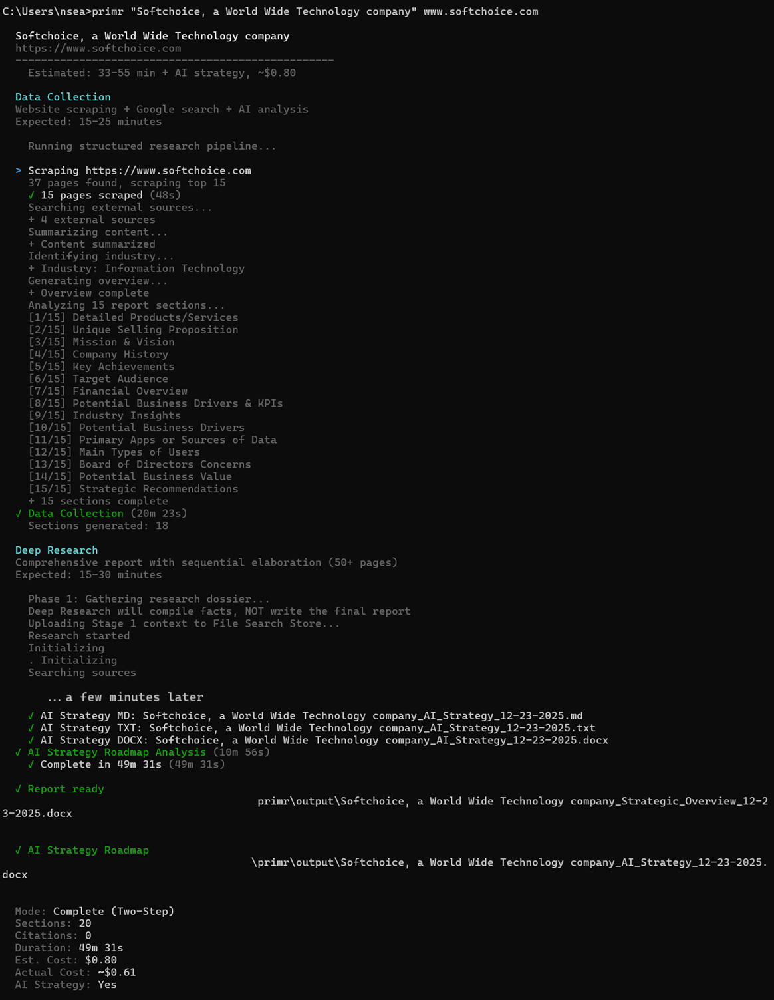

# Primr Documentation

**Company URL → sourced strategic brief.** Local-first CLI and agent tooling
for discovery, account planning, diligence, and strategy work, with structured
collection, confidence labels, and durable artifacts, not a free-form chat
essay.

{ width="920" }

*Illustrative demo with placeholder company data. Not a live capture of a real
target. Regenerate via [`CONTRIBUTING.md`](CONTRIBUTING.md).*

| Start here | Link |
|------------|------|
| Install and shortest path | [Root README](https://github.com/blisspixel/primr/blob/main/README.md) · [Installation](INSTALLATION.md) |
| Agent-host operation (Primr Zero by default) | [AGENTS.md](https://github.com/blisspixel/primr/blob/main/AGENTS.md) · [Agent Integration](AGENT_INTEGRATION.md) · [Zero-cost](ZERO_COST.md) |
| Modes, costs, cost gate | [Run modes](RUN_MODES.md) |
| Changing Primr source | [CLAUDE.md](https://github.com/blisspixel/primr/blob/main/CLAUDE.md) · [Contributing](CONTRIBUTING.md) |

The root README is a **front door** only. Operator detail lives in the guides
below (Diataxis: learning, doing, looking up, understanding).

> **Index currency:** reviewed against primr **1.39.13** on **2026-09-02**. The
> *Updated* column is each document's last substantive revision (git
> `last-commit` date). `tests/test_docs_index.py` fails CI if a doc under
> `docs/` is missing from this map or an index link does not resolve, so the
> map and the tree cannot silently drift apart.

## Getting started (tutorials)

| Document | Description | Updated |
|----------|-------------|---------|
| [INSTALLATION](INSTALLATION.md) | Install, upgrade, and troubleshoot Primr or prepare a source checkout | 2026-09-01 |
| [ZERO_COST](ZERO_COST.md) | Run keyless collection and finish a sourced dossier with an existing agent plan | 2026-09-01 |
| [API_KEYS](API_KEYS.md) | API key setup, validation (`primr keys test`), security, and troubleshooting | 2026-09-01 |
| [OPENROUTER](OPENROUTER.md) | Optional paid gateway preview, explicit opt-in, per-run ceilings, privacy defaults, and custom models | 2026-09-02 |
| [CONFIG](CONFIG.md) | First-run configuration and the full settings reference | 2026-09-01 |
| [RUN_MODES](RUN_MODES.md) | Run modes, costs, budget readiness, strategy selection, outputs, and zero-cost rendering | 2026-09-02 |
| [AZURE_QUICKSTART](AZURE_QUICKSTART.md) | Stand up the team/org Azure deployment end to end | 2026-07-18 |

## How-to guides (task-oriented)

| Document | Description | Updated |
|----------|-------------|---------|
| [BATCH](BATCH.md) | Run primr across many companies from a CSV | 2026-07-18 |
| [RECOVERY](RECOVERY.md) | Resume after a crash, reboot, or interrupted run | 2026-07-17 |
| [IMPROVE](IMPROVE.md) | Improve and refine an existing report (`primr improve` / `refine`) | 2026-04-10 |
| [SKILL_PACK](SKILL_PACK.md) | `primr skills` end to end: planning, curation, artifacts, CLI/MCP | 2026-08-13 |
| [EVAL](EVAL.md) | Evaluate and compare models with the eval harness | 2026-08-22 |
| [MODEL_ONBOARDING](MODEL_ONBOARDING.md) | Register and validate a new model | 2026-08-13 |
| [AGENT_INTEGRATION](AGENT_INTEGRATION.md) | Operate Primr from MCP, A2A, skills, and agent hosts | 2026-09-01 |
| [OPENCLAW](OPENCLAW.md) | OpenClaw integration and governed workflows | 2026-08-13 |
| [COPILOT_COWORK_GUIDE](COPILOT_COWORK_GUIDE.md) | Sideload a skill pack into Microsoft 365 Copilot Cowork | 2026-07-21 |
| [COPILOT_STUDIO_GUIDE](COPILOT_STUDIO_GUIDE.md) | Use primr from Copilot Studio | 2026-07-21 |
| [FOUNDRY_AGENT_GUIDE](FOUNDRY_AGENT_GUIDE.md) | Use primr from a Microsoft Foundry agent | 2026-07-21 |
| [CLOUD_DEPLOYMENT](CLOUD_DEPLOYMENT.md) | Serverless deployment on AWS, Azure, and GCP | 2026-08-13 |
| [SECURITY_OPS](SECURITY_OPS.md) | Key rotation, audit logs, operational security | 2026-08-13 |

## Reference (look-up)

| Document | Description | Updated |
|----------|-------------|---------|
| [API](API.md) | MCP server and A2A protocol, programmatic usage | 2026-08-13 |
| [Job Status](JOB_STATUS.md) | Versioned CLI, MCP, A2A, and API lifecycle contract | 2026-07-10 |
| [STRATEGY_PORTFOLIO](STRATEGY_PORTFOLIO.md) | YAML-defined long-form strategy documents and selection | 2026-08-30 |
| [NEXT_STEPS](NEXT_STEPS.md) | One executable release card, dependency gates, and version update protocol | 2026-09-02 |
| [CHANGELOG](CHANGELOG.md) | Version history | 2026-09-02 |
| [MIGRATION](MIGRATION.md) | Error-hierarchy migration notes | 2026-02-02 |
| [EVAL_V1_24_0](EVAL_V1_24_0.md) | Historical decision record: the v1.24.0 cross-provider eval plan | 2026-06-26 |
| [ROADMAP](https://github.com/blisspixel/primr/blob/main/ROADMAP.md) | Release dependencies, long-range gates, and implementation ledger | 2026-09-02 |

## Explanation (understanding why)

| Document | Description | Updated |
|----------|-------------|---------|
| [Company Analyst Product Contract](design/company-analyst-product-contract.md) | Canonical product, long-form artifact, free-first economics, evaluation, and release contract | 2026-08-30 |
| [ARCHITECTURE](ARCHITECTURE.md) | System design and the 9-tier scraping engine | 2026-09-01 |
| [ARTIFACTS](ARTIFACTS.md) | The research-vs-shipping artifact pipeline and ship-time gates | 2026-09-01 |
| [INTERNALS](INTERNALS.md) | Core algorithms and prompt strategy | 2026-08-13 |
| [STATE_MACHINES](STATE_MACHINES.md) | Tier escalation and job lifecycle | 2026-02-02 |
| [CONCURRENCY](CONCURRENCY.md) | Threading and concurrency model | 2026-08-13 |
| [SECURITY](SECURITY.md) | Security policy and the scoped AI/agent threat model | 2026-08-22 |
| [design/](design/README.md) | Per-workstream design docs and decision audits | — |

## Contributing

| Document | Description | Updated |
|----------|-------------|---------|
| [CONTRIBUTING](CONTRIBUTING.md) | Dev environment setup and the contribution workflow | 2026-08-13 |
| [CLAUDE.md](https://github.com/blisspixel/primr/blob/main/CLAUDE.md) | The development contract: seams, constraints, verification gates | — |
