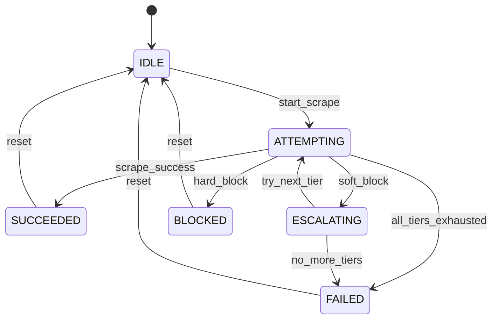
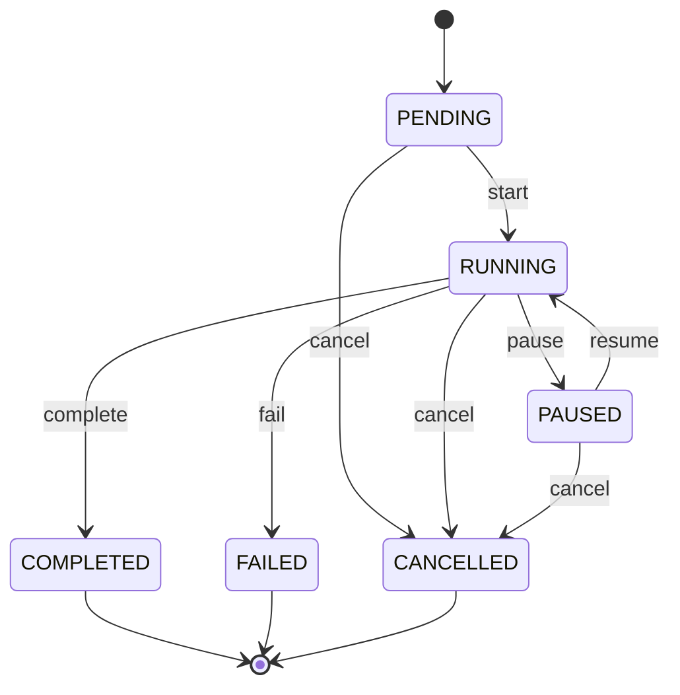

# State Machine Specifications

This document provides state machine specifications for Primr's tier escalation and job lifecycle management.

## Overview

Primr uses formal state machines to manage:
1. **Tier Escalation**: The process of trying progressively more capable scraping methods
2. **Job Lifecycle**: The states a research job goes through from creation to completion

These state machines provide:
- Clear definition of valid states and transitions
- Transition guards for conditional logic
- State invariants for correctness guarantees
- Event emission for monitoring and debugging

## Tier Escalation State Machine

### States

| State | Description |
|-------|-------------|
| `IDLE` | No scraping in progress |
| `ATTEMPTING` | Currently trying a scraping tier |
| `ESCALATING` | Current tier failed, preparing to try next |
| `SUCCEEDED` | Scraping completed successfully |
| `FAILED` | All tiers exhausted without success |
| `BLOCKED` | Hard block detected (e.g., CAPTCHA, IP ban) |

### State Diagram



### Transitions

| From | To | Trigger | Description |
|------|-----|---------|-------------|
| IDLE | ATTEMPTING | `start_scrape` | Begin scraping with first tier |
| ATTEMPTING | SUCCEEDED | `scrape_success` | Content extracted successfully |
| ATTEMPTING | ESCALATING | `soft_block` | Soft block detected (WAF, rate limit) |
| ATTEMPTING | FAILED | `all_tiers_exhausted` | No more tiers to try |
| ATTEMPTING | BLOCKED | `hard_block` | Hard block detected (CAPTCHA, IP ban) |
| ESCALATING | ATTEMPTING | `try_next_tier` | Move to next tier |
| ESCALATING | FAILED | `no_more_tiers` | No more tiers available |
| SUCCEEDED | IDLE | `reset` | Reset for next URL |
| FAILED | IDLE | `reset` | Reset for next URL |
| BLOCKED | IDLE | `reset` | Reset for next URL |

### State Invariants

| State | Invariant |
|-------|-----------|
| IDLE | No active scraping operation |
| ATTEMPTING | Current tier is set and valid |
| ESCALATING | Previous tier recorded, next tier available |
| SUCCEEDED | Content is non-empty and valid |
| FAILED | All tiers have been attempted |
| BLOCKED | Block reason is recorded |

### Usage Example

```python
from primr.utils.state_machine import create_tier_state_machine, TierState

# Create state machine
sm = create_tier_state_machine()
assert sm.state == TierState.IDLE

# Start scraping
sm.transition("start_scrape")
assert sm.state == TierState.ATTEMPTING

# Soft block detected - escalate
sm.transition("soft_block")
assert sm.state == TierState.ESCALATING

# Try next tier
sm.transition("try_next_tier")
assert sm.state == TierState.ATTEMPTING

# Success!
sm.transition("scrape_success")
assert sm.state == TierState.SUCCEEDED

# Reset for next URL
sm.transition("reset")
assert sm.state == TierState.IDLE
```

## Job Lifecycle State Machine

### States

| State | Description |
|-------|-------------|
| `PENDING` | Job created, waiting to start |
| `RUNNING` | Job is actively executing |
| `PAUSED` | Job temporarily suspended |
| `COMPLETED` | Job finished successfully |
| `FAILED` | Job encountered an error |
| `CANCELLED` | Job was cancelled by user |

### State Diagram



### Transitions

| From | To | Trigger | Description |
|------|-----|---------|-------------|
| PENDING | RUNNING | `start` | Begin job execution |
| PENDING | CANCELLED | `cancel` | Cancel before starting |
| RUNNING | PAUSED | `pause` | Temporarily suspend |
| RUNNING | COMPLETED | `complete` | Finish successfully |
| RUNNING | FAILED | `fail` | Error occurred |
| RUNNING | CANCELLED | `cancel` | User cancellation |
| PAUSED | RUNNING | `resume` | Continue execution |
| PAUSED | CANCELLED | `cancel` | Cancel while paused |

### Terminal States

The following states are terminal (no further transitions):
- `COMPLETED`
- `FAILED`
- `CANCELLED`

### State Persistence

Job state machines support persistence for crash recovery:

```python
from primr.utils.state_machine import JobStateMachine, JobState

# Create and run job
sm = JobStateMachine("job-123")
sm.transition("start")

# Save state
sm.save("jobs/job-123.json")

# Later, recover state
recovered = JobStateMachine.load("jobs/job-123.json")
assert recovered.state == JobState.RUNNING
assert recovered.job_id == "job-123"
```

### Persistence Format

```json
{
  "job_id": "job-123",
  "state": "running",
  "created_at": "2026-02-02T10:30:00",
  "history": [
    {
      "from_state": "pending",
      "to_state": "running",
      "trigger": "start",
      "timestamp": "2026-02-02T10:30:00",
      "context": {}
    }
  ]
}
```

### Usage Example

```python
from primr.utils.state_machine import create_job_state_machine, JobState

# Create job
sm = create_job_state_machine("research-abc123")
assert sm.state == JobState.PENDING

# Start execution
sm.transition("start")
assert sm.state == JobState.RUNNING
assert sm.is_active

# Pause for rate limiting
sm.transition("pause")
assert sm.state == JobState.PAUSED

# Resume
sm.transition("resume")
assert sm.state == JobState.RUNNING

# Complete successfully
sm.transition("complete")
assert sm.state == JobState.COMPLETED
assert sm.is_terminal
```

## Event Listeners

Both state machines support event listeners for monitoring:

```python
from primr.utils.state_machine import create_job_state_machine, StateChangeEvent

def on_state_change(event: StateChangeEvent):
    print(f"Job transitioned: {event.from_state} -> {event.to_state}")
    print(f"Trigger: {event.trigger}")
    print(f"Time: {event.timestamp}")

sm = create_job_state_machine("job-123")
sm.add_listener(on_state_change)

sm.transition("start")
# Output:
# Job transitioned: JobState.PENDING -> JobState.RUNNING
# Trigger: start
# Time: 2026-02-02 10:30:00
```

## Error Handling

Invalid transitions raise `InvalidTransitionError`:

```python
from primr.utils.state_machine import (
    create_job_state_machine,
    InvalidTransitionError,
)

sm = create_job_state_machine("job-123")

try:
    sm.transition("complete")  # Can't complete from PENDING
except InvalidTransitionError as e:
    print(f"Invalid: {e.from_state} -> {e.to_state} via '{e.trigger}'")
    # Output: Invalid: JobState.PENDING -> None via 'complete'
```

## Integration with Telemetry

State transitions can be traced using the telemetry system:

```python
from primr.utils.state_machine import create_job_state_machine, StateChangeEvent
from primr.utils.telemetry import TelemetrySystem

telemetry = TelemetrySystem()

def trace_state_change(event: StateChangeEvent):
    telemetry.record_event(
        "state_transition",
        {
            "from_state": event.from_state.value,
            "to_state": event.to_state.value,
            "trigger": event.trigger,
        }
    )

sm = create_job_state_machine("job-123")
sm.add_listener(trace_state_change)
```

## Version History

| Version | Date | Changes |
|---------|------|---------|
| 1.0 | Feb 2026 | Initial specification |
